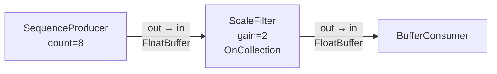
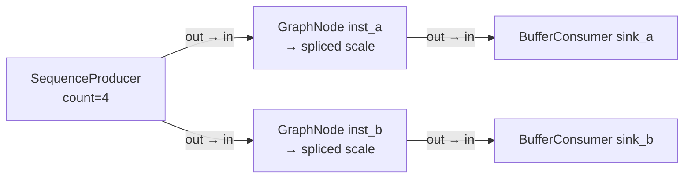
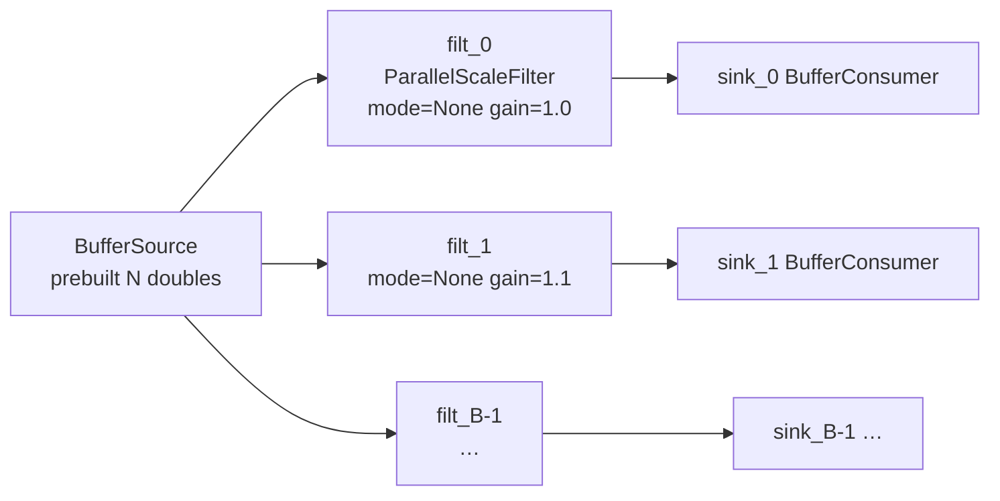
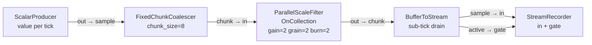
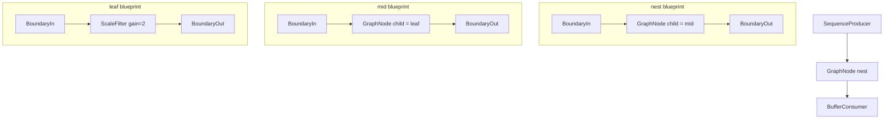
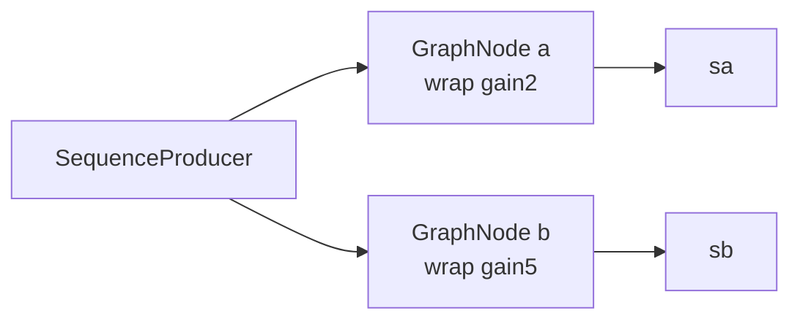
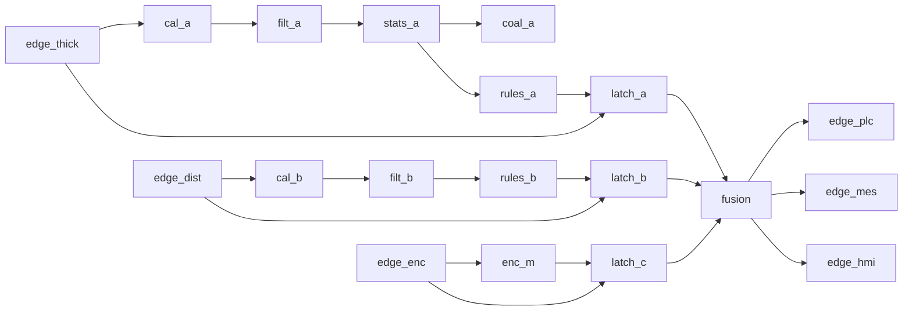

# Demos

Runnable programs under [`demos/`](../demos/). Each target links `node_engine` and includes node headers from `nodes/`.

## How to build and run

From the repo root (Windows, after MSVC env via `scripts/dev_env.ps1` if needed):

```powershell
.\scripts\build.ps1
.\build\demos\minimal_pipeline.exe
.\build\demos\coalesce_stream_demo.exe
.\build\demos\bench_parallel_scale.exe
.\build\demos\bench_branch_fanout.exe
.\build\demos\chunk_parallel_dechunk_demo.exe
.\build\demos\trigger_latency_demo.exe
.\build\demos\nested_depth_validate_demo.exe
.\build\demos\line_quality_monitor_demo.exe
```

CMake registers targets in [`demos/CMakeLists.txt`](../demos/CMakeLists.txt) via `node_engine_demo(...)`.

### Result notes

- Timing tables below were captured on a **Windows x64 Debug** build, **MSVC 19.44**, machine with **`hardware_concurrency = 16`**.
- Absolute `ms/tick` / `GB/s` / trigger µs are **not** Release optima; use them for relative scaling and correctness.
- Checksums must match across worker/grain configs for the same logical inputs.
- Insight demo queue **1–6 complete**.

---

## 1. `minimal_pipeline`

| | |
|---|---|
| **Source** | [`demos/minimal_pipeline.cpp`](../demos/minimal_pipeline.cpp) |
| **Kind** | Correctness / smoke walkthrough |
| **Session model** | `Engine{2}`; uses `run_once` (compile + one tick) twice |

### Purpose

Smoke the core path end-to-end:

1. Linear authoring graph → flatten → tick → consumer buffer.
2. Nested `GraphNode` instances (shared blueprint, two independent clones) spliced at compile time.
3. Factory registration count printed.

### Graph A — linear



**Authoring wires**

| From | Pin | To | Pin |
|------|-----|----|-----|
| `producer` | `out` | `filter` | `in` |
| `filter` | `out` | `consumer` | `in` |

### Graph B — nested fan-out of two GraphNode instances

Blueprint (shared):


Outer graph (after flatten, wrappers/boundaries disappear; two scaled chains remain):



### Expected behavior

| Check | Expectation |
|-------|-------------|
| Linear consumer size | `8` samples |
| Linear values | `0 2 4 6 8 10 12 14` (sequence `[0..7] * 2`) |
| Nested sinks | Both size `4` |
| Nested values | `first=0`, `last=9` (sequence `[0..3] * 3`) |
| Exit | `0`, prints `demo ok` |

### Observed results

```
node_engine pipeline demo
consumer received 8 samples: 0 2 4 6 8 10 12 14
nested sinks ok (gain 3): first=0 last=9
registered node types: <N>
demo ok
```

---

## 2. `coalesce_stream_demo` (insight demo 1/6)

| | |
|---|---|
| **Source** | [`demos/coalesce_stream_demo.cpp`](../demos/coalesce_stream_demo.cpp) |
| **Kind** | Session streaming + coalescer correctness |
| **Session model** | `Engine{2}` kept for whole feed; **`compile()` once**, **`tick()` per sample** |

### Purpose

Prove:

- Session-scoped `tf::Executor` reuse across many ticks.
- `FixedChunkCoalescer` only emits when a chunk is full.
- Mid-fill does not leave a partial buffer on the sink.
- Second full chunk still works on the same compiled graph.
- Another `Engine` can inject the same shared executor.

### Graph


**Authoring wires**

| From | Pin | To | Pin |
|------|-----|----|-----|
| `src` | `out` | `coal` | `sample` |
| `coal` | `chunk` | `sink` | `in` |

Coalescer also exposes `ready` (bool output) read by the demo (not wired).

### Expected behavior

| Phase | Ticks | `ready` | Sink |
|-------|-------|---------|------|
| Fill first chunk | samples `1..7` | `false` | empty |
| Complete first chunk | sample `8` | `true` | `[1,2,3,4,5,6,7,8]` |
| Second chunk | samples `100..107` | `true` at end | `[100..107]` |
| Shared executor | construct `Engine{shared}` | same underlying `tf::Executor*` | — |
| Exit | — | — | `coalesce_stream_demo ok`, exit `0` |

### Observed results

```
coalesce_stream_demo
session workers: 2 (executor reused across ticks)
chunk_size: 8
tick 1 sample=1 ready=false sink_n=0
…
tick 7 sample=7 ready=false sink_n=0
tick 8 sample=8 ready=true sink_n=8 sink=[1..8]
emits: 2 (expected 2)
second chunk: 100 101 102 103 104 105 106 107
coalesce_stream_demo ok
```

---

## 3. `bench_parallel_scale` (insight demo 2/6)

| | |
|---|---|
| **Source** | [`demos/bench_parallel_scale.cpp`](../demos/bench_parallel_scale.cpp) |
| **Kind** | Intra-node parallel scale microbench |
| **Session model** | New `Engine{workers}` per config; many ticks on one compiled flat graph |

### Purpose

Sweep **workers × grain × N × burn** through a single parallel filter:

- Intra-node work split via **Taskflow `Subflow`** on the session executor (`ParallelMode::OnCollection`).
- Report wall **ms/tick**, filter-centric **GB/s** (`2 * N * 8` bytes), **speedup vs 1-worker**, **checksum**.
- Checksums must be stable across workers/grains for the same `(N, burn)` (gain fixed at `1.5`).

### Graph


**Authoring wires**

| From | Pin | To | Pin |
|------|-----|----|-----|
| `src` | `out` | `filt` | `in` |
| `filt` | `out` | `sink` | `in` |

Filter `gain` literal = `1.5`. After `compile()`, demo rebinds cloned nodes and resets source data / grain / burn.

### Sweep parameters

| Axis | Values (typical on hw≥4) |
|------|---------------------------|
| workers | `1, 2, 4, hardware_concurrency` |
| grain | `0` (scheduler default), `256, 1024, 4096, 16384` |
| N | `64Ki, 1Mi` (+ `2Mi` if hw≥4) |
| burn | `1, 8` extra mul-adds per element |
| warmup / timed | `3` / `8` ticks |

### Expected behavior

| Check | Expectation |
|-------|-------------|
| Correctness | Same checksum for same `(N, burn)` regardless of workers/grain |
| B=parallel path | `grain` and workers change **time**, not results |
| Light burn / small N | Limited speedup (memory + edge-copy bound) |
| Heavy burn / large N | Clearer multi-worker gain, still sub-linear |
| Exit | `bench_parallel_scale ok`, exit `0` |

`GB/s` is **filter in+out only**; producer/sink edge copies add overhead not in that numerator.

### Observed results (sample, hw=16, Debug)

Header shape:

```
workers N  grain  burn  ms/tick  GB/s  speedup  checksum
```

| workers | N | grain | burn | ms/tick | GB/s | speedup | checksum |
|--------:|--:|------:|-----:|--------:|-----:|--------:|---------:|
| 1 | 65536 | 0 | 1 | 0.644 | 1.63 | 1.00 | 1.4719e+05 |
| 16 | 65536 | 0 | 1 | 0.463 | 2.27 | 1.39 | 1.4719e+05 |
| 1 | 65536 | 4096 | 1 | 0.502 | 2.09 | 1.00 | 1.4719e+05 |
| 16 | 65536 | 4096 | 1 | 0.353 | 2.97 | 1.42 | 1.4719e+05 |
| 1 | 2097152 | 16384 | 8 | 30.549 | 1.10 | 1.00 | 8.0552e+07 |
| 16 | 2097152 | 16384 | 8 | 13.105 | 2.56 | **2.33** | 8.0552e+07 |

**Readout**

- Correctness: checksums stable.
- Very small grains can be slower (task overhead).
- Best multi-worker cases here ~**2–2.3×** on 16 threads — healthy for a copy-heavy Debug engine path, **not** peak hardware efficiency.

---

## 4. `bench_branch_fanout` (insight demo 3/6)

| | |
|---|---|
| **Source** | [`demos/bench_branch_fanout.cpp`](../demos/bench_branch_fanout.cpp) |
| **Kind** | Inter-node branch concurrency microbench |
| **Session model** | New `Engine{workers}` per config; fan-out graph compiled once per config |

### Purpose

Measure **sibling branch parallelism** after a single producer fan-out:

- Each branch filter forced to **`ParallelMode::None`** so scaling is **not** from intra-node grain splits.
- Independent gains per branch (`1.0 + 0.1 * b`) so miswiring shows up in the combined checksum.
- Sweep **workers × branches × N × burn**.

### Graph



**Authoring wires** (for each branch `b` in `0 .. B-1`)

| From | Pin | To | Pin |
|------|-----|----|-----|
| `src` | `out` | `filt_b` | `in` |
| `filt_b` | `out` | `sink_b` | `in` |

### Sweep parameters

| Axis | Values (typical on hw≥8) |
|------|---------------------------|
| workers | `1, 2, 4, hardware_concurrency` |
| branches B | `1, 2, 4, 8` (+ `16` if hw≥8) |
| N | `64Ki, 256Ki` (+ `1Mi` if hw≥4) |
| burn | `1, 8` |
| warmup / timed | `3` / `8` ticks |

**Metrics**

- `ms/tick` — wall time per full-graph tick  
- `GB/s` — `2 * N * 8 * B` (all branch filters in+out)  
- `speedup` — vs 1-worker baseline for same `(B, N, burn)`  
- `checksum` — weighted sum of per-sink checksums  

### Expected behavior

| Check | Expectation |
|-------|-------------|
| B=1 | Extra workers **should not** help much (serial chain only) |
| B↑ + burn↑ + N↑ | Multi-worker **speedup increases** as independent work grows |
| Correctness | Same combined checksum across worker counts for fixed `(B,N,burn)` |
| Sink sizes | Each sink length `N` |
| Exit | `bench_branch_fanout ok`, exit `0` |

### Observed results (sample, hw=16, Debug)

| workers | branches | N | burn | ms/tick | GB/s | speedup | checksum |
|--------:|---------:|--:|-----:|--------:|-----:|--------:|---------:|
| 1 | 1 | 65536 | 1 | 0.364 | 2.88 | 1.00 | 9.8126e+04 |
| 16 | 1 | 65536 | 1 | 0.362 | 2.90 | 1.01 | 9.8126e+04 |
| 1 | 4 | 65536 | 1 | 1.181 | 3.55 | 1.00 | 4.5864e+05 |
| 2 | 4 | 65536 | 1 | 0.772 | 5.43 | 1.53 | 4.5864e+05 |
| 1 | 16 | 262144 | 1 | — | — | 1.00 | 1.1959e+07 |
| 16 | 16 | 262144 | 1 | 12.337 | 5.44 | ~2.14 | 1.1959e+07 |
| 1 | 16 | 1048576 | 8 | 216.176 | 1.24 | 1.00 | 8.9465e+09 |
| 16 | 16 | 1048576 | 8 | 59.485 | 4.51 | **3.63** | 8.9465e+09 |

**Readout**

- Control: **B=1 → ~1×** speedup (as designed).
- Wide fan-out + heavy burn: up to **~3.6×** on 16 workers in Debug.
- Light configs can show noise / temporary slowdowns (scheduling + deep edge copies).
- Still sub-linear vs ideal B-way or worker-way scaling — expected with per-edge buffer clones and per-tick Taskflow rebuild.

---

## 5. `chunk_parallel_dechunk_demo` (insight demo 4/6)

| | |
|---|---|
| **Source** | [`demos/chunk_parallel_dechunk_demo.cpp`](../demos/chunk_parallel_dechunk_demo.cpp) |
| **Kind** | Correctness: coalesce → parallel chunk → dechunk stream |
| **Session model** | `Engine{4}` kept for whole feed; **`compile()` once**, **`tick()` per scalar** |

### Purpose

End-to-end temporal + parallel path on one session executor:

1. **Coalesce** scalars into fixed `FloatBuffer` chunks (`FixedChunkCoalescer`).
2. **Parallel transform** each full chunk (`ParallelScaleFilter`, `OnCollection`, small grain).
3. **Dechunk** back to scalars via `BufferToStream` **sub-ticks** inside one outer `tick()`.
4. **Record** only when `stream.active` is true (gate), so coarse dirty-cone re-runs during mid-fill do not re-append the last sample.

Also documents a practical authoring pattern: stream sinks often need an **`active`/`ready` gate** while the engine still marks the whole reachable cone dirty each seed tick.

### Graph



**Authoring wires**

| From | Pin | To | Pin |
|------|-----|----|-----|
| `src` | `out` | `coal` | `sample` |
| `coal` | `chunk` | `filt` | `in` |
| `filt` | `out` | `stream` | `chunk` |
| `stream` | `sample` | `rec` | `in` |
| `stream` | `active` | `rec` | `gate` |

`StreamRecorder` is demo-local (not a registered builtin): appends `in` only when `gate == true`.

### Parameters

| Knob | Value |
|------|------:|
| workers | 4 |
| chunk_size | 8 |
| gain | 2.0 |
| grain | 2 (forces multi-slice on 8-wide chunks) |
| burn_iters | 2 |
| samples fed | 16 (two full chunks: `1..16`) |

**Scaled sample formula** (matches filter burn chain):

\[
x_0 = s,\quad x_{k+1} = x_k \cdot \mathrm{gain} + 10^{-7}\ (k < \mathrm{burn})
\]

With `gain=2`, `burn=2`: output ≈ `4, 8, 12, …` for inputs `1, 2, 3, …`.

### Expected behavior

| Phase | Outer ticks | Coalescer | Filter out | Stream | Recorder |
|-------|-------------|-----------|------------|--------|----------|
| Mid-fill chunk 1 | samples `1..7` | `ready=false`, empty chunk | empty / idle | `active=false` | size `0` |
| Complete chunk 1 | sample `8` | `ready=true`, `n=8` | `n=8` | drained in-pass; `active=true` on last emit | size `8`, values scaled `1..8` |
| Mid-fill chunk 2 | samples `9..15` | empty again | idle | `active=false` | **stays** `8` (gate off) |
| Complete chunk 2 | sample `16` | full emit | `n=8` | full drain | size `16`, scaled `1..16` |
| Exit | — | 2 emits | — | — | `chunk_parallel_dechunk_demo ok`, exit `0` |

**Engine mechanics exercised**

- Session executor reused across 16 outer ticks.
- `run_pass` local **sub-ticks** while `BufferToStream` stays `dirty` until the chunk is drained.
- Intra-node **Subflow** parallel on the filter when the chunk is full.
- Empty mid-fill coalescer buffer must not reload `BufferToStream` (empty-buffer guard).

### Observed results

```
chunk_parallel_dechunk_demo
session workers: 4 (executor reused; sub-ticks drain BufferToStream)
chunk_size=8 gain=2 grain=2 burn=2
graph: ScalarProducer -> FixedChunkCoalescer -> ParallelScaleFilter -> BufferToStream -> StreamRecorder

tick 1 sample=1 ready=false coal_n=0 filt_n=0 stream_active=false recorded=0
…
tick 7 sample=7 ready=false coal_n=0 filt_n=0 stream_active=false recorded=0
tick 8 sample=8 ready=true coal_n=8 filt_n=8 stream_active=true recorded=8
tick 9 sample=9 ready=false coal_n=0 filt_n=0 stream_active=false recorded=8
…
tick 15 sample=15 ready=false coal_n=0 filt_n=0 stream_active=false recorded=8
tick 16 sample=16 ready=true coal_n=8 filt_n=8 stream_active=true recorded=16

recorded 16 scaled samples: 4 8 12 16 20 24 28 32 36 40 44 48 52 56 60 64
chunks_emitted=2 (expected 2)
chunk_parallel_dechunk_demo ok
```

**Readout**

- Coalesce boundaries and full in-pass dechunk drain behave as designed.
- Gate on `active` is required with today’s coarse dirty cone; without it, mid-fill ticks re-apply the last stream sample.
- Related fix in [`nodes/buffer_to_stream.hpp`](../nodes/buffer_to_stream.hpp): do not reload queue from an **empty** inbound chunk; clear `active` when idle.

---

## 6. `trigger_latency_demo` (insight demo 5/6)

| | |
|---|---|
| **Source** | [`demos/trigger_latency_demo.cpp`](../demos/trigger_latency_demo.cpp) |
| **Kind** | Trigger queue correctness + wake latency |
| **Session model** | `Engine{2}` kept for whole run; **`compile()` once**; work driven by `triggers()` |

### Purpose

Exercise the inbound **`TriggerQueue`** path end-to-end:

1. Empty-queue `poll_trigger_and_run` → `false`.
2. Single `push("src")` + poll → dirty cone + pass → correct sink buffer.
3. FIFO order via `try_pop` (`filt` then `src`).
4. Timed **`push` + `poll_trigger_and_run`** loop (same-thread latency).
5. Burst enqueue then drain-all poll loop.
6. Cross-thread producer: `push` from a worker thread; main **`wait_pop` + `mark_dirty_reachable` + `tick`**.

### Graph


Triggers name the seed node id (`"src"` or, for FIFO check, `"filt"`).  
`poll_trigger_and_run` = `try_pop` → `mark_dirty_reachable` → `tick`.

**Authoring wires**

| From | Pin | To | Pin |
|------|-----|----|-----|
| `src` | `out` | `filt` | `in` |
| `filt` | `out` | `sink` | `in` |

### Parameters

| Knob | Value |
|------|------:|
| workers | 2 |
| count | 8 |
| gain | 2.0 |
| warmup / timed polls | 20 / 200 |
| burst size | 32 |
| async pushes | 64 (background thread) |

### Expected behavior

| Check | Expectation |
|-------|-------------|
| Empty poll | returns `false`, queue stays empty |
| Single trigger | sink `[0,2,4,6,8,10,12,14]` (sequence × gain) |
| FIFO | `try_pop` order matches push order |
| Timed loop | 200 successful polls; sink still size 8 |
| Burst | push 32, drain exactly 32 polls, then empty |
| Async | 64 `wait_pop` handoffs; queue empty; sink still correct |
| Exit | `trigger_latency_demo ok`, exit `0` |

### Observed results (Debug, hw=16)

```
trigger_latency_demo
session workers: 2
graph: SequenceProducer -> ScaleFilter -> BufferConsumer
path: triggers().push(src) + poll_trigger_and_run / wait_pop

empty poll: ok (false)
single trigger: sink n=8 first=0 last=14 ok
FIFO try_pop: filt then src ok
push+poll_trigger_and_run: n=200 min=92.1 us p50=97.4 us p90=122.1 us p99=189.0 us max=265.9 us mean=104.5 us
burst push 32 + drain: 3.119 ms (97.478 us/trig avg)
wait_pop+mark+tick (async producer): n=64 min=90.7 us p50=103.5 us p90=14478.5 us p99=15560.5 us max=15561.6 us mean=2300.9 us

trigger_latency_demo ok
```

| Path | p50 | Notes |
|------|----:|-------|
| `push` + `poll_trigger_and_run` | ~**97 µs** | Same-thread; includes full graph pass (N=8 scale) |
| Burst avg | ~**97 µs/trig** | Matches single-path order of magnitude |
| `wait_pop` + mark + tick (async) | p50 ~**104 µs**, p90/max **~15 ms** | High tail from intentional `sleep_for(50µs)` every 7th push + scheduler noise; min still ~91 µs when queue already hot |

**Readout**

- Trigger queue is correct: empty/FIFO/single/burst/async all green.
- Same-thread wake+pass is ~**0.1 ms** Debug for this tiny graph — fine for control-rate triggers, not a claim about bare mutex cost alone (pass dominates).
- Async path proves cross-thread `push` / `wait_pop` without losing triggers; tails include producer sleeps, not pure engine latency.

---

## 7. `nested_depth_validate_demo` (insight demo 6/6)

| | |
|---|---|
| **Source** | [`demos/nested_depth_validate_demo.cpp`](../demos/nested_depth_validate_demo.cpp) |
| **Kind** | Authoring validation + nested `GraphNode` flatten/splice |
| **Session model** | `Engine{2}`; `validate_graph` / `compile` / `tick` |

### Purpose

Close the insight set by proving:

1. **`validate_graph`** reports unknown nodes, missing pins, type mismatches, cycles, self-cycles.
2. **`add_node` duplicate id** throws; **`compile`** refuses invalid graphs.
3. **Depth-1 / depth-3** macros splice to a flat DAG — no wrappers or boundaries left.
4. Prefixed leaf ids (`box/scale`, `nest/child/child/scale`).
5. **Stacked gains** inside one blueprint (`*2` then `*3` → `*6`).
6. **Sibling depth-2 instances** stay independent (gain 2 vs 5).

### Graphs

**Depth-1**


Blueprint inside `box`:


After flatten: `src → box/scale → sink`.

**Depth-3** (wrap of wrap of scale leaf)



After flatten: leaf id **`nest/child/child/scale`**, edges=2, nodes=3 (`src`, scale, `sink`).

**Stacked gains (one macro)**


Inner: `in → s2(gain=2) → s3(gain=3) → out` → values `[0,1,2,3,4] * 6`.

**Sibling depth-2**



### Expected behavior

| Section | Expectation |
|---------|-------------|
| Unknown wire target | error contains `unknown node` |
| Missing pin | `missing output pin` |
| Buffer → scalar consumer | `incompatible types` |
| A↔B cycle / self-wire | `cycle` / `self-cycle` |
| Duplicate `add_node` | throws `duplicate node id` |
| `compile` invalid | throws `validate_graph failed` |
| Depth-1 | flat `src sink box/scale`; sink last=`9` (count=4, gain=3) |
| Depth-3 | scale id `nest/child/child/scale`; sink `0 2 4 6` |
| Stacked | sink[1]=`6`, sink[4]=`24` |
| Siblings | sa[2]=`4`, sb[2]=`10` |
| Exit | `nested_depth_validate_demo ok`, exit `0` |

### Observed results

```
nested_depth_validate_demo
insight: validate_graph + deep GraphNode flatten/splice

== validate_graph failures ==
  unknown node: wire to unknown node: missing
  missing pin: missing output pin a.nope
  type mismatch: incompatible types on wire a.out -> b.in
  cycle: graph contains a cycle
  self-cycle: self-cycle on node: a
  duplicate id (add_node throw): duplicate node id: a
  compile rejects invalid: validate_graph failed: self-cycle on node: a
validate failures: ok

== depth-1 GraphNode ==
  flat nodes: src sink box/scale
  sink last=9 ok

== depth-3 nested GraphNodes ==
  scale flat id: nest/child/child/scale
  edges=2 nodes=3
  sink: 0 2 4 6 ok

== stacked gains inside one macro (*2 then *3 = *6) ==
  sink[1]=6 sink[4]=24 ok

== sibling depth-2 instances (gains 2 and 5) ==
  sa[2]=4 sb[2]=10 ok

nested_depth_validate_demo ok
```

**Readout**

- Validation surface is actionable and wired into `compile`.
- Nested macros fully disappear at schedule time; path prefixes preserve instance identity.
- Deep wrap chains and sibling clones both produce correct independent results.

---

## Comparison of insight demos

| Demo | Focus | Highlight (this machine, Debug) |
|------|--------|----------------------------------|
| `bench_parallel_scale` | Intra-node `Subflow` | ~**2.3×** speedup (N=2Mi, burn=8, 16w) |
| `bench_branch_fanout` | Inter-node siblings | ~**3.6×** speedup (B=16, N=1Mi, burn=8, 16w) |
| `chunk_parallel_dechunk_demo` | Coalesce → parallel → dechunk | 16 scaled samples, 2 chunk drains |
| `trigger_latency_demo` | `TriggerQueue` wake + poll | ~**97 µs** p50 push+poll (N=8 graph) |
| `nested_depth_validate_demo` | Validate + deep flatten | depth-3 id `nest/child/child/scale`; all checks green |

**Insight queue 1–6 complete.** Session executor, temporal nodes, parallel paths, triggers, and nesting/validate are covered by demos.

---

## 8. `line_quality_monitor_demo` (shop-floor multi-root)

| | |
|---|---|
| **Source** | [`demos/line_quality_monitor_demo.cpp`](../demos/line_quality_monitor_demo.cpp) |
| **Nodes** | [`nodes/line_quality/`](../nodes/line_quality/) (header-only, `REGISTER_NODE`) |
| **Design** | [`docs/line-quality-monitor.md`](line-quality-monitor.md) |
| **Kind** | Correctness (Phase A) + light async capacity (Phase B) |
| **Session model** | `Engine{4}`; `compile` once; `TriggerQueue` + `poll_trigger_and_run` per edge emit |

### Purpose

Prove a **multi-root, desynced** line-quality monitor with **no sensor mux choke point**:

1. Three input edges (`edge_thick`, `edge_dist`, `edge_enc`) are graph roots; each owns a private ring and branch.
2. Dual input format: thickness emits `FloatBuffer` size `24*K` for **K=1** (sample) and **K=10** (chunk) under one compute model.
3. Virtual-time event queue drives edges at different periods (~20 / 7 / 2 kHz frames).
4. Late join only at **fusion** (LKG + freshness + motion gates + go/nogo).
5. Planted spike, dent, encoder stop, and stale-C paths flip go correctly; coalescer counts **frames**, not emits.
6. Phase B: three async producer threads + mutex-guarded arm/poll for **~5 s** (iteration default; raise to 60s when stable), with **1 Hz live metrics** (input emit/frame/MB/s, poll rate, coalescer, fusion state, PLC/HMI rates).

### Graph (authoring)



**Authoring wires (summary)**

| Branch | Path |
|--------|------|
| A thickness | `edge_thick` → cal → EMA → stats → rules + coalescer; latch_a from rules + `t_stamp` |
| B distance | `edge_dist` → cal → EMA → profile rules; latch_b |
| C encoder | `edge_enc` → motion → latch_c (`line_ok`, pos/vel) |
| Join | latches → `fusion` → PLC / MES / HMI sinks |

No node fans into the three edges; no `sensor_mux` / `edge_daq_all`.

### Expected behavior

| Check | Expectation |
|-------|-------------|
| Multi-root | Edges have no inbound wires |
| Phase A K=1 | spike, dent, go true, go false on stop, go false on stale C, `coal_ready ≥ 1` |
| Phase A K=10 | same correctness; **fewer** thick emits than K=1 for similar duration |
| Coalesce K=W=20 | single emit → `ready=true`, window size `24*20` |
| Phase B | each async edge produces >0 emits in ~5 s wall; live 1 Hz metric blocks printed |
| Exit | `line_quality_monitor_demo ok`, exit `0` |

### Observed results (sample, Debug, MSVC 19.44)

```
line_quality_monitor_demo
session workers: 4
topology: edge_thick|edge_dist|edge_enc -> branches -> fusion -> sinks
no sensor mux; dual format K=1 and K=10 on edge_thick

multi-root: edge_thick/dist/enc have no inbound wires ok

--- Phase A K_thick=1 ---
frames_a=2006 emits_a=2006 coal_ready=100 spike=1 dent=1 go_true=1
go_false_stop=1 go_false_stale=1 nogo=0 mes_events=0

--- Phase A K_thick=10 ---
frames_a=2050 emits_a=205 coal_ready=100 spike=1 dent=1 go_true=1
go_false_stop=1 go_false_stale=1 nogo=0 mes_events=0

--- coalesce K=W=20 single emit ---
single-emit full window ok

--- Phase B light (async producers, ~5s wall) ---
targets: thick … | dist … | enc …
live metrics every 1s …
[  1s]
  INPUT inst  A … emit/s … frame/s … MB/s   B …   C …
  INPUT avg   …
  GRAPH       poll … Hz  coal_win …  in_payload … MB/s
  KEY NODES   fusion go=… | thick mean=… | dist dent=… | enc line_ok=… pos_mm=…
  SINKS       plc … Hz  hmi … Hz  go_true …%
…
=== Phase B summary (60.0s wall) ===
INPUT rates / PAYLOAD / GRAPH / SINKS totals

line_quality_monitor_demo ok
```

**Readout**

- Dual format is frame-count based: K=10 used ~10× fewer thick emits for similar frame count.
- Coalescer completed full windows on both paths and on a single K=W emit.
- Stale-C and encoder-stop both forced go false; healthy motion allowed go true.
- Phase B currently runs ~**5 s** (iteration) with a live dashboard: per-edge input rate & payload MB/s, graph poll/coalesce bandwidth, fusion/key-node state, sink update rates. Targets are a ~**10× plant stress** (A 200 kHz / B 70 kHz / C 20 kHz) with large batched K so emit cadence stays ~1 kHz under Windows sleep granularity; achieved rates will lag on Debug when the poll path saturates.

---

## Planned (follow-ups, not demos)

Optional later engine work (not part of the six-demo set): descendant-only sub-ticks, fewer edge copies, Release perf baselines, WaitSequence/Select, JSON, SHM.

Shop-floor follow-ups for line quality (optional): nogo sustain assert, MES event asserts, Release rate targets, real edge I/O adapters.

---

## Related docs

- Engine / pin / flatten rules: [`docs/initial-specs.md`](initial-specs.md)
- Line quality design: [`docs/line-quality-monitor.md`](line-quality-monitor.md)
- Build: [`BUILD.md`](../BUILD.md)
- Overview: [`README.md`](../README.md)
