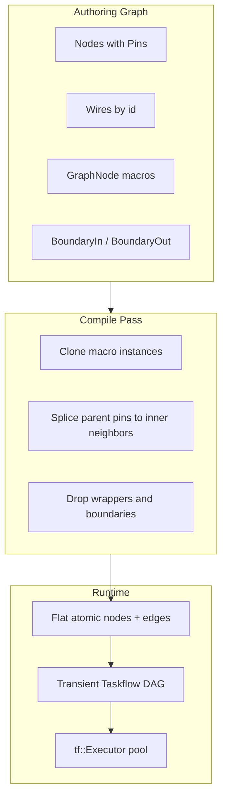

# C++20 Hybrid Node-Graph Engine — Initial Specs

> **Onboarding / install / first build:** see the root [README.md](../README.md).  
> **This document** is the architecture plan, feature set, node-author surface, and roadmap.

## Defaults

**Repository:** new standalone git repo (working name `sensor-graph` / `node-engine`). Not part of the kalea UI codebase; no shared paths, tooling, or Nuxt assumptions.

**Language:** C++20, headers + thin `.cpp` where needed.

**Build:** CMake 3.20+, FetchContent for Taskflow, `cmake --build` demos/tests.

**Deps:** Taskflow only (+ system threads). No Boost, no TBB, no JSON lib in core. Persistence is optional later.

**Style:** small types, `std::`, no deep inheritance trees, no reflection framework.

## Architecture (final spec)



**Rules locked by latest chat:**

1. **Everything is a pin** — stream or value. No separate parameter system. Unwired pin → literal; wired pin → stream/value from upstream.
2. **Custom graph is source of truth** — Taskflow is a transient scheduler only.
3. **Nesting** — same `Graph` type inside `GraphNode`; boundary nodes own the exposed pin lists; flatten splices parent wires directly to inner neighbors; scheduler never sees nesting.
4. **Instance cloning by default** — each `GraphNode` instance expands to its own inner nodes/state. Optional `Lifetime::Shared` lifetime later.
5. **Nodes are thread-agnostic** — only `compute()`; no `std::thread` in node code.
6. **Coalesce / de-coalesce are normal nodes**, not base-template magic.

## Core feature set (implement)

### 1. Value + pin model

- Closed `enum class TypeId` (`Float`, `Bool`, `String`, `FloatBuffer`, `Dynamic`).
- `using Value = std::variant<std::monostate, double, bool, std::string, std::vector<double>>`.
- `struct Pin { std::string id; TypeId type; Value literal; bool connected; Value buffer; }`.
- Runtime read: `connected ? buffer : literal`.
- Small explicit autoconvert table (e.g. `Bool`↔`Float`); all other mismatches require a converter node.

### 2. Node + factory

```cpp
enum class ParallelMode { None, OnCollection, Always };

struct ParallelHint {
  ParallelMode mode = ParallelMode::None;
  std::size_t grain_size = 0; // 0 = engine / Taskflow default chunking
};

struct Slice {
  std::size_t begin = 0;
  std::size_t end = 1; // [begin, end)
};

class Node {
public:
  virtual ~Node() = default;
  virtual std::string_view type_id() const = 0;

  // Single entry point — engine always calls this
  // (scalar, full buffer, or one parallel chunk)
  virtual void compute(Slice slice) = 0;

  virtual ParallelHint parallel_hint() const { return {}; }
  virtual std::size_t parallel_length() const { return 0; } // N when collection-parallel applies
  virtual void propagate_types() {}

  std::vector<Pin> inputs, outputs;
  bool dirty = true;
};
```

`NodeFactory` + `REGISTER_NODE(Type, "type_id")` static registration (one translation unit per node).

**One compute function** — no separate `compute` / `compute_range`. The engine decides the slice. Nodes stay thread-agnostic; **only the scheduler** calls Taskflow.

### 3. Graph, wires, roles

```cpp
struct Wire {
  std::string from_node, from_pin, to_node, to_pin;
};

class Graph {
  std::vector<std::unique_ptr<Node>> nodes;
  std::vector<Wire> wires;
  // stable string ids
};
```

Roles as metadata only: `Producer | Transformer | Consumer | BoundaryIn | BoundaryOut | GraphWrapper` — used for validation/docs, not a deep class hierarchy.

Edit-time: reject cycles; reject incompatible pin types (unless autoconvert allowed).

### 4. Nesting + flatten (required, kept simple)

- `BoundaryInput` / `BoundaryOutput` nodes inside a graph that will be wrapped.
- `GraphNode` holds `std::unique_ptr<Graph> inner` (or shared template + clone-on-expand).
- **Compile:** for each `GraphNode` instance → clone inner graph; for each outer wire to macro pin `p`, retarget to successors/predecessors of the matching boundary pin → erase wrapper + boundary nodes from the flat list.
- Output of compile: `FlatGraph { nodes, edges }` with only atomic compute nodes.
- Taskflow build maps 1:1 from `FlatGraph` (`emplace` + `precede`). No nesting awareness in scheduler.

### 5. Execution pipeline

Per tick / trigger:

1. `propagate_types()` on authoring graph (or on flat graph).
2. `compile_flat()`.
3. Copy values along flat edges (read-only fan-out; each node writes only its outputs).
4. Build transient `tf::Taskflow` from dirty reachable nodes; `executor.run(...).wait()`.
5. **Intra-node parallelization** (required, simple rules below).

### 5b. Parallelize compute (collections / always / grain)

Two levels (both use the same Taskflow executor):

1. **Inter-node** — independent branches after flatten run concurrently via `precede` (automatic).
2. **Intra-node** — one node's buffer work is sliced with `tf::Subflow::for_each_index` (or equivalent).

**Single `compute(Slice)` — engine sets execution shape:**

| ParallelMode | Engine calls |
| :--- | :--- |
| `None` (default) | Once: `compute({0, N})` with `N = parallel_length()` or `{0,1}` for scalar-only nodes |
| `OnCollection` | If `N` large enough: Taskflow subflow several `compute({b,e})` in parallel; else one full `compute({0,N})` |
| `Always` | Same as `OnCollection` whenever `N > 0`, even for smaller buffers |

Author writes **one** body that loops `for (i = slice.begin; i < slice.end; ++i)` (or ignores slice when work isn't index-based). No second function.

**Grain / items per thread (keep simple):**

- `ParallelHint::grain_size == 0` → engine/Taskflow default; `> 0` → fixed chunk length.
- Do **not** expose per-node thread count — only global `tf::Executor`.

**Safety rules:**

- Parallel chunks must be independent (no cross-index writes; inputs read-only).
- Output buffer pre-sized before subflow joins.
- Below threshold, engine does not split (one full-slice call).

**Not in MVP:** auto-parallel every `FloatBuffer` node without an opt-in hint.

### 6. Temporal gate nodes (required, as normal nodes)

- `FixedChunkCoalescer`: scalar/stream in → fixed `FloatBuffer` out; `dirty = false` until full.
- `BufferToStream`: buffer in → scalar out per sub-tick; stays dirty until drained.
- Engine rule: after compute, if node clears dirty, skip scheduling its downstream for this pass; if de-coalescer stays dirty with no new upstream input, run a **local sub-tick** on its descendant cone only.

### 7. Inbound triggers (simple)

- Producers may push their node id into a `std::mutex` + `std::queue` trigger queue (engine-owned).
- Main loop: wait/pop triggers → mark downstream dirty → run pass.
- No process-per-node; no custom thread pools beyond Taskflow + optional dedicated producer wait inside engine-owned tasks later.

### 8. Event / sequenced triggers (core capability, tiny)

Need: "on trigger A, wait for trigger B, then emit trigger C." This is **node-local state + dirty control**, not a separate trigger runtime.

**Engine must provide (already mostly planned):**

1. **Per-instance mutable state** inside the node object (survives across ticks).
2. **Node-controlled emit** via `dirty` + output pin write — same gate used by coalescers (`dirty = false` suppresses downstream; `dirty = true` produces a new downstream tick).
3. **Discrete trigger representation** on pins — use `Bool` pulses; treat a **rising edge** (`false`→`true`) or a one-shot `true` as an event. Optional tiny helper: `rising_edge(prev, cur)`.
4. **Schedule the node when any wired input updates** — the node decides whether that update is enough to emit.

**Engine does _not_ need:**

- A second global trigger bus for mid-graph logic (producer `TriggerQueue` only wakes the top-level pass).
- Engine-owned state machines or "retain trigger" APIs.
- Special Wait nodes baked into the scheduler.

**Node pattern (example state machine):**

```text
Idle  --(edge on arm)-->  Armed
Armed --(edge on go)----> emit out pulse, dirty=true --> Idle
Armed --(arm again)-----> stay Armed / re-arm (policy)
any state where no emit --> dirty=false (downstream sleeps)
```

Built-in `WaitSequence` / rendezvous node is **optional sugar**; custom nodes can own this logic entirely.

**Feature detectors** (e.g. local max → pulse) are also **internal node logic**, not engine services. Example: distance sensor stream on a round part — keep previous sample(s) / slope in node state; when value was rising and now falls, emit a `Bool` pulse (and optional latched distance). Engine only supplies the float stream, dirty/ticks, and instance state; peak/edge/threshold logic stays in the node (or an optional reusable `LocalMaxPulse` sugar node later).

### 9. Encoder and part memory (outside the engine)

These are **application concerns**, not engine services:

- **Encoder** — just another signal on **pins** (producer node or wired float). Any node that needs position takes an `encoder` input pin (or reads a shared upstream wire). No graph-owned encoder singleton in the engine.
- **PartStore / multi-part tracks** — external to the engine (app service, PLC bridge, DB, user library). Nodes that need it hold a pointer/reference supplied by the app at construction, or call into app code; the engine does not provide `PartStore`, `ExecContext::parts()`, or encoder matching APIs.

Engine responsibility stops at: pins, wires, flatten, schedule, dirty/emit, optional parallel ranges. Production-line identity (part id, encoder-offset correlation, keep/discard history) is built **on top** by custom nodes + external memory.

## Node author surface (one chapter: simple + declarative via composition)

Goal: a node file reads as a **declaration of capabilities** plus a short compute body. C++ won't give Graphite/Rust macros for free — use **named descriptor members + one registration macro**, not deep template magic.

### Pattern

Compose small tag objects on the node type. The engine (or a thin `NodeAdapter<T>`) reads those members via **requires / member pointers / conventional names**, or the node fills pins once in a `describe(NodeBuilder&)` method. Prefer the builder form for clarity and debuggability:

```cpp
// nodes/scale_filter.cpp
#include <node_engine/node.hpp>

struct ScaleFilter : node_engine::Node {
  // --- declarative capabilities (composition) ---
  static constexpr auto meta = node_engine::Meta{
    .type_id = "scale_filter",
    .role = Role::Transformer,
  };

  // Pins = data paths AND knobs (unwired → literal). Everything is a pin.
  static void ports(node_engine::Ports& p) {
    p.in<float>("signal");                 // stream or literal
    p.in<float>("gain").literal(1.0);      // default knob
    p.out<float>("out");
  }

  // Parallelism: omit = None. Opt in only when range-parallel is safe.
  static constexpr auto parallel = node_engine::ParallelHint{
    .mode = ParallelMode::OnCollection,
    .grain_size = 0, // 0 = engine default
  };

  // --- behavior: one function; engine passes full slice or a parallel chunk ---
  void compute(Slice s) override {
    auto const& in = buffer_in<float>("signal");
    auto& out = buffer_out<float>("out");
    float g = get<float>("gain");
    for (std::size_t i = s.begin; i < s.end; ++i)
      out[i] = in[i] * g;
    emit();
  }
};

REGISTER_NODE(ScaleFilter);
```

### What each declaration maps to

| Declaration | Capability |
| :--- | :--- |
| `Meta{type_id, role}` | Factory key; Producer/Transformer/Consumer/Boundary docs |
| `ports(...)` + `.literal(...)` | Pin set; unwired pins act as parameters (incl. encoder if needed as an input pin) |
| `ParallelHint` | `None` / `OnCollection` / `Always` + grain; engine chooses slice schedule |
| `compute(Slice)` | Sole work entry; scalar = `{0,1}` or full `{0,N}`; parallel chunk |
| `emit()` / `suppress()` (dirty) | Downstream trigger control |
| Instance fields on struct | Private state (armed flag, last sample for local-max, etc.) |
| App-injected members (optional) | e.g. `PartStore*` from outside the engine |
| `REGISTER_NODE` | Single-file registration — no central switch |

### Stateful event example (still one file)

```cpp
struct ArmThenGo : node_engine::Node {
  static constexpr auto meta = Meta{
    .type_id = "arm_then_go",
    .role = Role::Transformer,
  };

  static void ports(Ports& p) {
    p.in<bool>("arm");
    p.in<bool>("go");
    p.out<bool>("fire").literal(false);
  }

  bool armed = false;
  bool prev_arm = false, prev_go = false;

  void compute(Slice) override {
    // ignore slice — event logic is not index-parallel
    bool arm = get<bool>("arm"), go = get<bool>("go");

    if (rising(prev_arm, arm))
      armed = true;

    if (armed && rising(prev_go, go)) {
      set_out("fire", true);
      armed = false;
      emit();
    } else {
      set_out("fire", false);
      suppress();
    }

    prev_arm = arm;
    prev_go = go;
  }
};

REGISTER_NODE(ArmThenGo);
```

### App-level part latch (not engine)

Encoder from pins, store injected:

```cpp
// Lives in the application / integration layer, not in node_engine core.
struct StationLatch : node_engine::Node {
  explicit StationLatch(app::PartStore* store) : store_(store) {}

  static constexpr auto meta = Meta{
    .type_id = "station_latch",
    .role = Role::Transformer,
  };

  static void ports(Ports& p) {
    p.in<double>("encoder");                          // from wire; engine does not own encoder
    p.in<double>("measure");
    p.in<double>("station_offset").literal(650.0);
    p.in<double>("tolerance").literal(2.0);
    p.in<bool>("probe_pulse");
    p.out<bool>("latched");
  }

  void compute(Slice) override {
    if (!rising_pulse("probe_pulse")) {
      suppress();
      return;
    }

    store_->match_or_open(
            get<double>("encoder"),
            get<double>("station_offset"),
            get<double>("tolerance"))
        .set("measure", get<double>("measure"));

    set_out("latched", true);
    emit();
  }

  app::PartStore* store_ = nullptr; // external
};
```

### Design rules for this surface

- **One convention, not two systems:** literals live on pins. No separate Params API.
- **Composition over inheritance:** capabilities are static descriptors + helpers (`rising`, `emit`, `Ports`), not a deep class tree.

## Optional features (only if still simple)

| Feature | Why |
| :--- | :--- |
| Built-in `WaitSequence` (arm→go→out) | Same as Select — convenience primitive; custom stateful nodes already can do it once dirty/edge rules exist |
| Built-in `LocalMaxPulse` / peak detector | Pure DSP in a node (prev sample + slope); optional catalog sugar only |
| Built-in `Select` / mux node | Convenience only — any custom node can take `select` + `a` + `b` and implement the same logic in `compute()`. Prefer shipping when canvas authors need a reusable primitive; not required for the engine core. If added: use **active-branch + selector** reactivity (emit on selector change or active data update; ignore inactive branch for dirty). |
| `Lifetime::Shared` singleton nodes | Useful for device handles; easy to misuse with mutable DSP state |
| Dedicated thread-domain subgraphs | Cross-domain buffers/backpressure add real complexity |
| Polymorphic scalar+collection auto-map in every node | Prefer explicit coalesce nodes + typed pins; auto-map as later sugar |
| Heavy tuple/SFINAE meta wrappers | Avoid; use the composition descriptors in "Node author surface" instead |
| JSON/Protobuf save-load | Useful but orthogonal; add after core runs (header-only JSON only if needed) |
| Legacy SHM bridge producer | Migration aid, not core |
| Auto UI metadata / inspector reflection | Out of scope for engine lib |
| Dot dump of flat Taskflow | Cheap debug nice-to-have via Taskflow `dump()` |
| App PartStore / MES integration | Outside `node_engine`; custom nodes + external services |

## Suggested repo layout

```text
sensor-graph/                  # new repository root
  README.md
  CMakeLists.txt
  cmake/                       # FetchContent helpers if needed
  include/node_engine/
    value.hpp
    pin.hpp
    node.hpp
    factory.hpp
    graph.hpp
    flatten.hpp
    scheduler.hpp              # Taskflow translation
    trigger_queue.hpp
  src/
    factory.cpp
    flatten.cpp
    scheduler.cpp
  nodes/
    boundary.hpp
    chunk_coalescer.hpp
    buffer_to_stream.hpp
    examples/...
    # optional later: select.hpp (mux sugar; custom nodes can own this logic)
  demos/
    minimal_pipeline.cpp
  tests/                       # lightweight asserts or Catch2 via FetchContent later
  LICENSE
```

## Implementation order

0. **Bootstrap repo** — git init, CMake project, FetchContent Taskflow, empty library target + hello demo.
1. **Values, pins, Node, Graph, wires, factory** — single-thread execute, no Taskflow yet.
2. **Type check + propagate + autoconvert table.**
3. **Everything-is-a-pin literals** on unwired inputs.
4. **Boundary + GraphNode + clone + splice flatten** — verify nested macros expand correctly with two instances.
5. **Taskflow scheduler** on flat graph; standard policy.
6. **Intra-node parallel** — single `compute(Slice)` + `ParallelHint`; engine splits slices; demo DSP with `OnCollection`.
7. **Coalesce + de-coalesce + sub-tick prune rules.**
8. **Trigger queue** for producer-driven ticks.
9. **Optional:** WaitSequence/Select sugar, Shared lifetime, JSON, SHM producer, dedicated domains. App demos may show encoder-as-pin + external PartStore without putting either in the engine.

## Simplicity constraints (enforce in code review)

- No `Node*` in persisted/authoring wires — string ids only.
- No Taskflow includes in `nodes/` files.
- No macro expands shared mutable inner state unless `Lifetime::Shared`.
- Flatten is pure splice; do not keep nested Taskflow graphs.
- Prefer `std::vector` / `std::unordered_map` / `std::variant` / `std::unique_ptr` over custom containers.
- One closed `Value` variant; extend rarely.

## Success criteria

- Add a new filter = one file + `REGISTER_NODE`, no central switch edits.
- Two instances of the same macro keep independent state after flatten.
- Scheduler unit tests/demos never construct nested tasks for macros.
- Demo: producer → chunker → parallel filter → de-chunker → consumer, under Taskflow.
