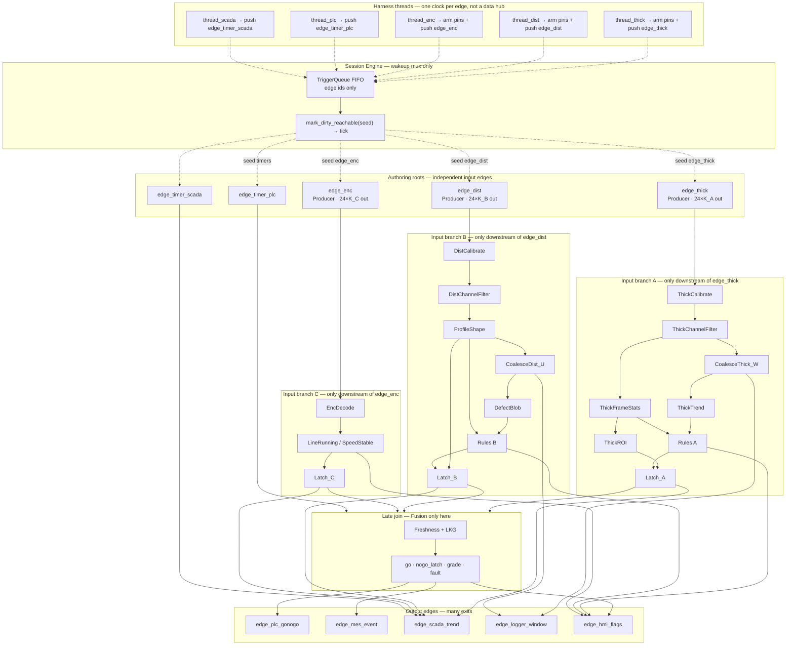

# Line quality monitor — real-world graph design

Design-only specification for a future demo (not implemented yet).  
Target binary name (suggested): `demos/line_quality_monitor_demo`.

Related engine docs: [initial-specs.md](initial-specs.md), [demo.md](demo.md).

---

## 1. Goal

Model **inline multi-sensor production-line quality monitoring**:

| Role | Real-world meaning |
|------|--------------------|
| Emitter A | **Laser thickness / gap array** (24 spots across web or part width) |
| Emitter B | **Distance / runout / height array** (24 probes or multipoint TOF) |
| Emitter C | **Encoder + motion auxiliaries** (position, speed, flags packed as 24×f32) |

**Constraints**

- Channel layout: **24 × f32 per frame** per emitter.
- Each physical source is its own **input edge node** and heads **its own input branch** (no shared intake choke point — see §2 / §6).
- Input edges emit **sample** (`K=1` frame) or **chunk** (`K>1` frames) as one `FloatBuffer` (`24×K`); branch nodes use **one compute model** for both (see §4 / §4b).
- ~**20 kHz** is a **rough average / capacity hint** for the fastest branch’s **frame** rate (thickness), **not** a global lockstep clock or a fixed emit rate.
- Sensors are **desynced**: different frame rates, emit batching, jitter, and independent edge triggers.
- Input data is **prebuilt once** and **replayed** (ring buffers) so metrics are not biased by allocation or file I/O.
- Output edge nodes **fake** external network apps (PLC, MES, SCADA, logger, HMI). No real sockets in v1.

---

## 2. Topology: multi-root edges, not one intake choke point

### Rejected shapes

| Rejected | Why |
|----------|-----|
| One shared 20 kHz tick advancing A+B+C | Fake lockstep; not shop floor |
| One “DAQ hub” / multiplexer node that ingests all sensors then fans out | **Input choke point** — couples unrelated I/O, serializes acquisition into one graph root, muddies dirty cones |
| Harness writes all rings into one bus pin / one seed id | Same choke point outside the graph |
| Fusion assumes same frame index `i` | Features arrive staggered; alignment is explicit (LKG) |

### Required shape

```text
  Edge_Thickness ──► Branch A (cal…latch) ──────────┐
  Edge_Distance  ──► Branch B (cal…latch) ───────┐  │
  Edge_Encoder   ──► Branch C (decode…latch) ──┐ │  │
                                              │ │  │
                                              ▼ ▼  ▼
                                         Fusion (join) ─► Output edges
```

| Rule | Detail |
|------|--------|
| **One edge node per source** | `edge_thick`, `edge_dist`, `edge_enc` are distinct authoring nodes (`Role::Producer` / input edge) |
| **Own input branch** | Wires from that edge only into that source’s transformers; **no** wire from edge A into branch B |
| **Multi-root graph** | The compiled flat graph has **three (or more) roots**, not one upstream funnel |
| **Trigger seed = edge node id** | `push("edge_thick")` → `mark_dirty_reachable(flat, "edge_thick")` dirty-cones **that branch** (+ anything downstream of its latch, e.g. fusion if wired) |
| **Join only where physics joins** | Fusion (and optional multi-input SCADA/HMI) are the intentional multi-input nodes — **late** in the graph, not at the sensors |
| **Harness is not a graph node** | Producer threads only arm **one** edge’s pins/ring cursor and push **that** edge’s id; they do not merge payloads |

Shop floor: each DAQ / fieldbus / encoder card is a separate cable into the cabinet. The graph mirrors that: **separate edges, separate branches**, shared executor/session only.

The runtime is still one session `Engine` / `tf::Executor` and one FIFO `TriggerQueue` for wake ordering — that is **scheduling**, not a data choke point. Payloads never meet until an explicit multi-input node.

---

## 3. Rate model (tunable defaults)

| Edge root | Nominal frame rate | Period | Notes |
|-----------|--------------------|--------|--------|
| `edge_thick` | ~20 kHz | ~50 µs | Fastest geometry array; own branch A |
| `edge_dist` | ~5–10 kHz | ~100–200 µs | Own branch B; often slower multipoint / TOF |
| `edge_enc` | ~1–4 kHz | ~250 µs–1 ms | Own branch C; may burst on motion |
| `edge_timer_plc` (optional) | 1 kHz | 1 ms | Separate root; poll latched go/nogo |
| `edge_timer_scada` (optional) | 50–200 Hz | 5–20 ms | Separate root; downsampled trends |

Add **jitter** on each **edge** producer deadline and occasional **gaps** (line stop, transport hiccup). Rates are per edge — not a shared intake clock.

```text
time ─────────────────────────────────────────────►
A:  |||||||||||||||||||||||||||||||||  ~20 kHz
B:  |---|---|---|---|---|---|---|---  ~5–10 kHz
C:  |---------||        |        |     ~1–2 kHz
```

---

## 4. Data layout (precompute + replay)

### Canonical unit: frame

One **frame** = one multi-channel sample at one sensor timestamp:

```text
frame  :=  24 × f32     // channels 0..23
```

Rings store frames only (never a separate “scalar” type for geometry branches); **one private ring per input edge**:

```text
ring_A[N_A][24]   thickness (raw or engineering units)
ring_B[N_B][24]   distance / height
ring_C[N_C][24]   encoder pack (see packing below)
```

### Wire payload: sample **or** chunk, same type

Input **edge** nodes (replay sources) always emit a `FloatBuffer` whose length is a multiple of 24:

| Mode | Buffer length | Meaning | Typical sensor timing |
|------|---------------|---------|------------------------|
| **Sample** | `24` | One frame | Per-interrupt / per-sample DAQ |
| **Chunk** | `24 × K` (`K ≥ 2`) | `K` frames, packed | DMA block, USB bulk, fieldbus packet, USB isoch burst |

**Packing (locked for MVP):** channel-major **within** each frame, frames **contiguous**:

```text
[ f0_c0..f0_c23 | f1_c0..f1_c23 | … | fK-1_c0..fK-1_c23 ]
```

Helpers (demo or small util):

```text
num_frames(buf) = buf.size() / 24      // require size % 24 == 0
frame_view(buf, i) = buf[i*24 .. i*24+24)
```

No second pin type for “chunk vs sample.” Downstream nodes **must not** branch on mode; they only see `K = num_frames(in)` and run the **same** per-frame (and per-channel) math for `K = 1` and `K > 1`.

### Encoder channel packing (MVP: uniform 24×f32)

| Channel | Content |
|--------:|---------|
| 0 | position (mm or counts as float) |
| 1 | velocity |
| 2 | acceleration (optional derived) |
| 3 | phase in period `[0,1)` or degrees |
| 4 | valid / quality flag (0/1) |
| 5+ | pad / spare auxiliaries |

A dedicated struct pin type can replace this later; uniform buffers match the current engine MVP.

### Synthetic truth (for asserts)

- **Thickness:** base 2.00 mm + slow sine + channel taper + rare **spike**.
- **Distance:** plane + bow + occasional **dent** on channels 10–12.
- **Encoder:** ramp position, mostly constant vel, with **stop gaps** to exercise `LineRunning`.

---

## 4b. Input edge emission: dual format, one compute model

### Why both formats

Shop-floor sources do not all push one interrupt per sample:

| Simulated timing | Edge emit shape | Trigger rate (approx) |
|------------------|-----------------|------------------------|
| Fast sample clock | `K=1` each deadline | ~ sensor Hz |
| Block transfer every `K` samples | one buffer of `K` frames | ~ sensor_Hz / K |
| Mixed / stress | alternate or configure per **edge/branch** | varies |

The **graph** must treat both as the same stream of frames. Coalesce windows, rules, latches, and fusion count **frames** (and time/mm), not “how many times the edge fired.”

### Input edge node contract (one node type family, three instances)

Each source is a **first-class edge** in the authoring graph, e.g. ids `edge_thick`, `edge_dist`, `edge_enc`. Same node class (or thin aliases), **separate instances**, each wired only into its branch.

| Port / behavior | Contract |
|-----------------|----------|
| Role | Input edge / `Producer` — graph root for its branch |
| `out` (`FloatBuffer`) | Length `24×K`, `K ≥ 1`, packing as above |
| `frames` / `K` (optional out) | `K` as double/int for diagnostics |
| `t0` or `t_stamp` | Timestamp of **first** frame in the emit (or per-frame stamps later) |
| Config `emit_frames` (`K`) | 1 = sample mode; >1 = chunk mode |
| Config `period_s` | Mean time **per frame** (sensor rate), not per chunk |
| Ring binding | **Private** to that edge instance (no shared ring cursor across edges) |
| Trigger | `push(edge_node_id)` only — never a generic `"daq"` seed for all sources |

**Branch wiring (authoring)**

```text
edge_thick.out → thick_cal.in → … → latch_A → (fusion / sinks)
edge_dist.out  → dist_cal.in  → … → latch_B → (fusion / sinks)
edge_enc.out   → enc_decode.in → … → latch_C → (fusion / sinks)
```

There is **no** node above the three edges that owns all sensor data. Optional timers (`edge_timer_plc`, `edge_timer_scada`) are additional roots, not parents of the sensor edges.

Pseudo (harness thread **per edge**, not one merged feeder):

```text
// thread dedicated to edge_thick only
deadline = now
loop:
  sleep_until(deadline + jitter)
  K = emit_frames_thick
  buf = concat(ring_A[i .. i+K))
  edge_thick.set_out_buffer(buf)   // or pin write API used by demo
  triggers.push("edge_thick")      // seed = THIS edge node id
  deadline += K * period_thick
```

**Invariant:** wall/virtual time tracks **frame count**, so a 20 kHz sensor with `K=10` fires ~2 kHz chunk triggers but still represents 20k frames/s of product data. Threads never publish into a sibling edge’s pins.

### Same compute model (all branch nodes)

Every geometry/motion transformer is **frame-oriented**:

```text
in:  FloatBuffer   // 24*K
out: FloatBuffer   // 24*K  (or features of length K / K*F)

compute(slice):
  assert in.size() % 24 == 0
  K = in.size() / 24
  // optional: parallel over channels and/or over frames via Slice
  for f in 0 .. K-1:
    process frame_view(in, f) → frame_view(out, f)   // same body for K=1
```

| Rule | Detail |
|------|--------|
| **No mode flag** | Do not `if (chunk) … else …`; `K=1` is just a short batch |
| **Per-frame purity** | Calibrate, denoise, frame stats, profile, rules apply **identically** to each frame in the batch |
| **State across emits** | EMA / trend / coalesce carry state across **frames**, whether those frames arrived as many `K=1` emits or fewer `K>1` emits |
| **Parallelism** | `OnCollection`: grain over `K*24` channels flattened, or outer loop frames + inner 24; both are valid as long as results match serial |
| **Coalesce** | Accumulates **frame count** (or mm), not emit count. A single `K=20` emit can complete `W_A=20` in one tick |
| **Latch** | Updates from the **last** frame in the batch (or exposes full-batch features); timestamp = last frame time unless noted |
| **Active / ready** | Chunk-wide: one ready pulse per emit when applicable; sub-frame dechunk only if a sink truly needs sample-rate streaming |

### Sample path vs chunk path (logically identical)

```text
SAMPLE MODE (K=1)                     CHUNK MODE (K=W)
emit → [frame] → cal → filter → …     emit → [frame×W] → cal → filter → …
                 └─ coalesce(W) ─┐                      └─ coalesce may
                    needs W emits│                         complete immediately
```

With the same nodes and wiring, switching `emit_frames` on the edge only changes **batching and trigger rate**, not graph topology or math.

### Relation to existing engine nodes

| Existing | Role relative to this design |
|----------|------------------------------|
| `FixedChunkCoalescer` | Scalar→buffer prototype; demo needs **frame** coalescer (`24×f32` units, count `W` frames) |
| `BufferToStream` | Optional **dechunk** when a consumer must see one frame (or one channel sample) per sub-tick |
| `ScaleFilter` / `OnCollection` | Pattern for channel-parallel ops on a flat `FloatBuffer`; extend to multi-frame buffers with `size % 24 == 0` |

Prefer **keeping multi-frame buffers intact** through calibrate → filter → stats when `K>1` (one dirty cone pass processes the whole DMA block). Use dechunk only at edges that are inherently sample-stream (e.g. some logger/HMI paths).

### Demo must prove (format dualism)

| Property | Expectation |
|----------|-------------|
| Bit-identical features | Same ring replay → same latch/rule bits for `K=1` vs `K=W` (within float assoc. tolerance if parallel) |
| Coalesce completeness | `W` frames complete a window whether delivered as `W` emits or one emit of `K=W` |
| Time base | Stale / sustain / Hz metrics use **frame time**, not emit count |
| Mixed branches | e.g. `edge_thick` chunked `K=10`, `edge_dist`/`edge_enc` sample `K=1` — fusion still LKG + freshness; still no shared input hub |

---

## 5. Runtime scheduling (per-edge triggers)

Scheduling multiplexes **wakeups** only. Each wakeup names **one edge root**; data stays on that root’s branch until fusion.

```text
[Thread thick]  arm edge_thick pins (24*K_A)  → push("edge_thick")
[Thread dist]   arm edge_dist  pins (24*K_B)  → push("edge_dist")
[Thread enc]    arm edge_enc   pins (24*K_C)  → push("edge_enc")
[Thread plc]    push("edge_timer_plc")     // optional separate root
[Thread scada]  push("edge_timer_scada")   // optional separate root

[Session main loop]
  id = triggers().wait_pop()
  mark_dirty_reachable(flat, id)   // cone from THAT edge (and downstream joins if reachable)
  tick(flat)                       // branch processes K frames for this emit
```

| Seed id | What should run |
|---------|-----------------|
| `edge_thick` | Edge thick + branch A (+ fusion/outputs **if** wired downstream of latch A and marked reachable) |
| `edge_dist` | Edge dist + branch B (+ …) |
| `edge_enc` | Edge enc + branch C (+ …) |
| `edge_timer_plc` | Timer edge + PLC poll path / fusion refresh without new geometry |

**Not** one `push("sensors")` that dirties all branches.

Default demo matrix (tunable):

| Edge node | Frame rate | `emit_frames` K | Trigger rate |
|-----------|------------|-----------------|--------------|
| `edge_thick` | 20 kHz | 1 **and** 10 (two runs or param) | 20 kHz / 2 kHz |
| `edge_dist` | 7 kHz | 1 | 7 kHz |
| `edge_enc` | 2 kHz | 1 | 2 kHz |

**Properties the demo should prove**

| Property | Expectation |
|----------|-------------|
| Multi-root | Flat graph has separate producer roots; no common sensor parent node |
| Branch isolation | Tick seeded at `edge_thick` does not require B/C frames; branch B work is not a prerequisite for A |
| Interleaving | Queue order = arrival order (FIFO) across edge ids |
| No barrier | Branch A never blocks waiting for branch B |
| Overrun | If thick outruns consumer, queue depth grows (measure HWM; optional drop policy later) |
| Stale fusion | Stop enc updates → fail-safe deassert `go` after `stale_C` |
| Independent coalesce | A windows complete on A **frames**; B on B **frames** |
| Format dualism | §4b bit-identical / coalesce / time-base checks |

**Engine note:** today’s dirty cone marks the full reachable downstream set from the seed. If latches wire into fusion, a thick edge tick may also re-run fusion with **LKG** B/C — that is correct **late join** behavior, not an input choke point. Finer prune is optional later. One chunk emit = one edge seed; that branch processes `K` frames inside the tick (plus optional intra-node parallel).

---

## 6. Branch layout (edge → own branch → late join)

```text
  edge_thick (input edge) ──► BRANCH A: cal → denoise → stats → window → rules → Latch_A ─┐
  edge_dist  (input edge) ──► BRANCH B: cal → denoise → profile → defect → Latch_B ───────┼─► FUSION
  edge_enc   (input edge) ──► BRANCH C: decode → speed/acc → phase → gates → Latch_C ─────┘     │
                                                                                              ▼
                                                                                   OUTPUT EDGES
                                                                              PLC · MES · SCADA · …
```

- **Horizontal:** each sensor path is self-contained from edge through latch.
- **Vertical join:** only at fusion (and multi-input output edges), never at a shared source hub.
- **Output edges** are separate consumer sinks on the far side (symmetric idea: many exits, many entrances).

---

## 7. Full logical graph



**Read the diagram as:** three sensor cables into three edge nodes; three vertical branches; one fusion bar; many outbound apps. The trigger queue is drawn above the roots as a **scheduler**, not as a wire that carries `FloatBuffer`.

---

## 8. Node responsibilities

**Shared contract for all branch transformers:** `in`/`out` geometry pins are `FloatBuffer` with `size % 24 == 0`, `K = size/24` frames per compute. Implementation is one loop (or parallel slices) over frames; **sample emit is `K=1`**, not a separate code path.

### Input edges — one instance per source (graph roots)

| Node id (example) | Role |
|-------------------|------|
| `edge_thick` | Producer root for branch A; private thickness ring; `out` = `24×K_A` |
| `edge_dist` | Producer root for branch B; private distance ring; `out` = `24×K_B` |
| `edge_enc` | Producer root for branch C; private encoder ring; `out` = `24×K_C` |
| `edge_timer_plc` / `edge_timer_scada` | Optional **additional** roots for poll cadences — not parents of sensor edges |

| Concern | Rule |
|---------|------|
| Topology | **No** `edge_daq_all` / mux / bus node upstream of these three |
| Wiring | Each `out` feeds only its branch until latch; cross-branch data only via fusion inputs |
| Config | Per-instance `emit_frames`, frame `period`, jitter, ring |
| Timing | Deadline += **K × period** on that edge’s thread only |
| Trigger | `push` of **that** node’s stable id |

### Branch A — thickness (downstream of `edge_thick` only)

| Node | Role |
|------|------|
| Calibrate | Per-channel affine → mm, **each** of K frames |
| ChannelFilter | Parallel EMA/FIR across channels (and frames); state advances **per frame** |
| FrameStats | mean, min, max, p2p **per frame** (length-K feature outs or packed) |
| ROI | Optional edge mask / center band, per frame |
| Coalesce W | Accumulate **W frames** (may complete inside one `K≥W` emit) |
| Trend | slope, ripple energy on window |
| Rules | in-spec band, uniformity, frame-to-frame spike (spike uses consecutive **frames**, including within a chunk) |
| Latch_A | last features + rule bits + timestamp (last frame in batch) |

### Branch B — distance / height (downstream of `edge_dist` only)

| Node | Role |
|------|------|
| Calibrate / filter | Same frame-batch pattern as A at B’s rate / K |
| ProfileShape | tilt, bow, residual vs plane, per frame |
| Coalesce U | U **B-frames** |
| DefectBlob | channels over threshold for M of U |
| Rules | height band, dent, flatness |
| Latch_B | latched features + bits + time |

### Branch C — encoder / motion (downstream of `edge_enc` only)

| Node | Role |
|------|------|
| Decode | pos, vel, acc, phase, valid from each frame in batch |
| LineRunning | `vel > v_min` (last or any-frame policy — lock: **last** frame) |
| SpeedStable | `std(vel window) < thr` over frame window |
| Latch_C | motion gates + **mm cursor** (last pos) for distance-based sustain |

### Fusion — late join only (not an input hub)

First place geometry + motion **meet** in the graph. Uses **last-known-good (LKG)** latches, not zipped indices and not a shared sample clock:

```text
fresh_A = (t_now - t_A) <= stale_A    # e.g. 0.25–1 ms
fresh_B = (t_now - t_B) <= stale_B    # e.g. 1–5 ms
fresh_C = (t_now - t_C) <= stale_C    # e.g. 5–20 ms

in_spec = ThickInSpec ∧ ThickUniform ∧ ¬ThickSpike
        ∧ HeightInSpec ∧ Flatness ∧ ¬Dent

line_ok = LineRunning ∧ SpeedStable ∧ fresh_C

# fail-safe product release
go = in_spec ∧ line_ok ∧ fresh_A ∧ fresh_B

# scrap latch: product distance or wall time — not “K thickness frames”
nogo_latch = integral_mm(¬in_spec ∧ line_ok) >= mm_thr
          OR timer_ms(¬in_spec ∧ line_ok)    >= ms_thr

grade      = soft score from margins to limits
fault_code = priority(spike > dent > thick > flat > height > motion)
```

**Rationale:** momentary noise ≠ scrap; sustained out-of-family **while the line is running** → reject/alarm. Sustain in **mm or ms** so slow branch B does not redefine scrap when branch A is fast. Fusion is a **consumer of latches**, never a parent of the input edges.

### Alignment strategies

| Strategy | Use | MVP? |
|----------|-----|------|
| LKG (last known good) | Default fusion inputs | **Yes** |
| Stale timeout | Safety / PLC go | **Yes** |
| Encoder mm binning | Defect “at position” | **Yes** (sustain) |
| Phase hold/match | Periodic tooling | Optional later |
| Explicit resample node | Fixed-rate SCADA | Optional (timer samples latches) |

---

## 9. Output edges (fake external apps)

| Edge node id | Cadence | Payload idea | Stand-in for |
|--------------|---------|--------------|--------------|
| `edge_plc_gonogo` | Fusion update and/or `edge_timer_plc` | `go`, `nogo_latched`, heartbeat | Discrete I/O / OPC coil |
| `edge_mes_event` | On latch / rising fault | `{t, fault_code, grade, phase, mm}` | MQTT/Kafka event API |
| `edge_scada_trend` | `edge_timer_scada` | mean thickness, bow, speed | Historian / dashboard |
| `edge_logger_window` | Coalesce `ready` on branch A/B | last A/B windows | QA dump |
| `edge_hmi_flags` | On rule/latch update | bitfield of rule outs | Operator panel |

Output edges are **sinks** on separate exit paths (many exits), symmetric to many input roots. v1 sinks **count emits**, checksum payloads, and record timestamps. No real network.

---

## 10. Coalesce and physical windows

- **Frame windows** are per-branch (`W` on A, `U` on B, `V` on C), measured in **frames**, independent of that edge’s `K`.
- A coalescer must accept a partial batch: e.g. need 7 more frames, incoming `K=10` → emit window now, keep 3 pending (same as receiving ten `K=1` ticks).
- Windows that mean “same length of product” should ultimately key off **encoder Δmm**, not equal frame counts across branches.
- Recommended demo defaults:
  - `W_A = 20` (~1 ms @ 20 kHz) for snappy tests; optional stress `W_A = 200`.
  - `U_B = 10` at ~5–10 kHz.
  - Sustain: e.g. **5–20 mm** or **5–20 ms** out of family while `line_ok`.
  - Dual-format check: run Phase A twice with `edge_thick` `K=1` and `K=10` (or `K=W_A`).

Heavy math lives on **coalesced paths** and **parallel channel filters**; per-emit path stays light (stats + spike + motion gates) whether the emit holds 1 or K frames. Shop practice: fast interlock + slower analytics; DMA chunks are an I/O shape, not a different algorithm.

---

## 11. Suggested demo phases (when implemented)

### Phase A — correctness (multi-root + desync + dual format)

1. Build authoring graph with **three input edge roots** and disjoint branches until fusion; prebuild **per-edge** rings.
2. Start **three** producer threads (one per edge) at nominal **frame** rates + jitter + phase offsets; each arms only its edge pins and `push`es only its edge id.
3. Plant: thickness spike, distance dent, encoder stop gap.
4. Assert:
   - compiled graph has **no** single upstream sensor mux / bus parent of A+B+C;
   - spike/dent affect the right rule bits without requiring simultaneous A/B frames;
   - encoder stop → `line_ok` false → `go` false (fail-safe);
   - stale C after timeout → `go` false;
   - `nogo_latch` / MES count matches sustained faults (mm or ms policy).
5. **Format matrix:** repeat key asserts with `emit_frames` on `edge_thick` ∈ `{1, 10}` (and optionally `K = W_A`) — latch/rule/MES outcomes match; coalesce window boundaries align on frame index.

### Phase B — throughput / capacity

1. Free-run **per-edge** producers (or paced); measure:
   - achieved **frame** Hz and **emit** Hz per edge + jitter;
   - trigger queue high-water mark (chunking should lower emit rate / queue pressure for same frame Hz);
   - fusion / PLC update latency (A frame timestamp → PLC observe);
   - × realtime vs nominal A/B/C **frame** rates.
2. Optional workers sweep on parallel filter nodes; compare `K=1` vs `K>1` CPU for same frame throughput.

### Phase C — ablation (optional)

Leave `edge_dist` or `edge_enc` unwired (or stop that thread) to attribute CPU and show fusion fail-safe when a branch is absent/stale — still without introducing a hub node.

---

## 12. Metrics

| Metric | Why |
|--------|-----|
| Frame Hz and emit Hz + jitter per **edge** | Multi-rate health; chunking splits the two |
| Trigger queue depth HWM | Overrun under skew; expect lower HWM at higher K for same frame Hz |
| µs seed→sink (per **edge id**) | Budgeting per emit (amortize over K frames when chunked) |
| `go` under stop / stale / burst A | Safety semantics |
| MES events vs planted sustained faults | Temporal logic |
| Checksums on SCADA/logger payloads | Determinism under replay |
| Feature parity `K=1` vs `K>1` | Same compute model proof |

**Realtime note:** full fusion + 3×24 FIR on every thickness **frame** is tight near 50 µs single-core; chunk emits amortize scheduling overhead across K frames. Heavy work still prefers coalesced windows and parallel channel ops.

---

## 13. Implementation defaults to lock before coding

| Knob | Proposed default |
|------|------------------|
| Graph roots | `edge_thick`, `edge_dist`, `edge_enc` (+ optional timer edges); **no** sensor mux root |
| Frame rates A/B/C | 20 kHz / 7 kHz / 2 kHz |
| `emit_frames` K per edge | **1 / 1 / 1** primary; **K_thick=10** second run for dual-format proof |
| Frame packing | Contiguous frames, 24 ch each (`size % 24 == 0`) |
| Jitter | ±10% of **frame** period (clamped); apply on that edge’s emit deadline after `K×period` |
| `stale_A/B/C` | 1 ms / 3 ms / 15 ms (wall/virtual time, not emit counts) |
| `W_A` / `U_B` | 20 / 10 **frames** |
| Sustain | 10 mm **or** 10 ms (pick one primary; allow both) |
| PLC | Fusion-driven **and** `edge_timer_plc` @ 1 kHz |
| SCADA | `edge_timer_scada` @ 100 Hz |
| Encoder packing | 24×f32 as in §4 |
| First cut | Correctness Phase A incl. multi-root + K-matrix + light throughput summary |

---

## 14. Mapping to current engine capabilities

| Design need | Existing support |
|-------------|------------------|
| Session executor | `Engine` + shared `tf::Executor` |
| Desynced wakeups | `TriggerQueue::push` / `wait_pop` / `poll_trigger_and_run` |
| Dirty from **one edge root** | `mark_dirty_reachable(flat, edge_node_id)` |
| Multi-root authoring | Multiple producers in one `Graph`; wires define separate branches |
| Parallel per-channel / batch work | `ParallelMode::OnCollection` + subflow grain on flat `FloatBuffer` |
| Scalar coalesce prototype | `FixedChunkCoalescer` (pattern only; not frame-aware) |
| Dechunk / sub-ticks | `BufferToStream` + `run_pass` when a sink needs one unit per sub-tick |
| Temporal arming | `ArmThenGo` / rising_edge helpers |
| Fan-out to many sinks | Multiple wires from one output (validate allows) |
| Nesting (optional macros) | `GraphNode` + flatten splice |
| Buffer-backed producer pattern | `BufferSource`-style `set_data` + `out` buffer (extend per edge instance) |

**Gaps / demo-local nodes likely needed**

- **Per-source input edge** class (or three configured instances): private ring, `emit_frames`, `FloatBuffer` out; **not** a multi-sensor hub.
- **Frame-aware** calibrate / filter / stats on each branch: one compute model, `K = size/24`.
- **FrameChunkCoalescer**: accumulate W **frames** from variable-K inputs (generalize `FixedChunkCoalescer`).
- Latch node (timestamp + last buffer/features) at end of each branch.
- Freshness + fusion boolean logic node(s) as the **late join** only.
- Fake **output** edge sinks with emit counters (and optional frame counters).
- Harness: **one thread per input edge** (+ optional timer threads) — never one thread that writes all edge pins in lockstep unless testing lockstep rejection.
- Optional `BufferToStream`-style **FrameUnbatch** only if a consumer must see `K=1` sub-ticks from a chunked wire.

---

## 15. Short story (for README blurb)

Three **separate input edge nodes** (thickness, distance, encoder) each own a replay ring and head an **independent branch**—no shared DAQ choke point. Edges emit **sample or chunk** (`24×K`) under one frame-batch compute model down the branch. A session **trigger queue** only multiplexes wakeups by edge id; payloads meet first at **late fusion** (LKG, freshness, motion gates, sustain in time or mm). Output edges mimic PLC, MES, SCADA, and HMI at their own cadences—shop-floor shaped multi-root I/O without real devices.

---

## 16. Status

| Item | Status |
|------|--------|
| Design (this doc) | **Done** |
| Demo code | **Not started** |
| Doc entry in [demo.md](demo.md) | Add when binary lands |

When implementing, extend [demo.md](demo.md) with purpose, diagram, expected behavior, and measured results in the same style as the insight demos.
