# Line quality monitor — typed multi-root design

Implemented demo: [`demos/line_quality_monitor_demo.cpp`](../demos/line_quality_monitor_demo.cpp).  
Nodes: [`nodes/line_quality/`](../nodes/line_quality/) (`lq_*` typed headers + legacy FloatBuffer nodes kept for reference).  
Short summary: [demo.md §8](demo.md). Related: [type-system-converters.md](type-system-converters.md), [initial-specs.md](initial-specs.md).

---

## 0. Current implementation (shipped)

| Item | Value |
|------|--------|
| Binary | `line_quality_monitor_demo` |
| Session | `Engine{4}`; `compile` once; `TriggerQueue` + `poll_trigger_and_run` per edge |
| Payloads | `ChannelChunkI16` / `ChannelChunkF32`, `EncoderRawI16` / `EncoderPoseF32`, `FrameFeaturesF32` |
| Converters (direct only) | I16 milli-units → F32 mm (`×1/1000`); encoder counts → mm (`/100`) |
| Branching | `CompareScalar` (**separate** `op` + `operand` pins) + `AndBool` + `RouteFeatures` |
| Const params | Unwired pin **literals** (e.g. GE/1.90, LE/2.10) |
| Harness | Virtual-time multi-rate event queue (~20 / 7 / 2 kHz frames); prebuilt I16/raw rings |
| Asserts | multi-root, validate+converters, spike/route_fault, dent, go true, go false stop, go false stale-C |
| Exit | `demo ok` (exit 0) |

**Topology implemented**

```text
edge_thick (I16) -[conv]-> cal_a -> ema_a -> stats_a -mean-> cmp_lo & cmp_hi -> thick_and
                                                   features -----------------> route.data
                                                   thick_and.pass -----------> route.sel
                                                   thick_and + mean + t -----> latch_ok
                                                   route.b ------------------> latch_fault
edge_dist  (I16) -[conv]-> cal_b -> dent_b -> latch_b
edge_enc   (raw) -[conv]-> motion_c -> latch_c
latch_ok + latch_b + latch_c -> fusion_simple -> edge_plc
```

Legacy `frame_*` / `FloatBuffer` LQM nodes remain under `nodes/line_quality/` but are **not** the active demo path.

---

## 1. Goal

Model **inline multi-sensor production-line quality monitoring**:

| Role | Real-world meaning | Typed demo payload |
|------|--------------------|--------------------|
| Emitter A | **Laser thickness / gap array** (24 spots) | `ChannelChunkI16` → F32 mm |
| Emitter B | **Distance / height array** (24 probes) | `ChannelChunkI16` → F32 mm |
| Emitter C | **Encoder + motion** | `EncoderRawI16` → `EncoderPoseF32` |

**Constraints (design + demo)**

- Geometry: **24 channels per frame**; rings store I16 **milli-units**; engineering units after edge converter.
- Each physical source is its own **input edge node** and heads **its own input branch** (no shared intake choke point — §2).
- Sensors are **desynced**: independent frame rates and edge triggers (virtual-time harness).
- Input data is **prebuilt once** and **replayed** (per-edge rings).
- Output edge **fakes** a PLC go/nogo sink in v1 (MES/HMI optional later). No real sockets.
- Decision params are **separate pins** (never bundle `op`+`operand`); const via unwired literals.
- Converters are **direct pairs only** (no multi-hop).

---

## 2. Topology: multi-root edges, not one intake choke point

### Rejected shapes

| Rejected | Why |
|----------|-----|
| One shared 20 kHz tick advancing A+B+C | Fake lockstep; not shop floor |
| One “DAQ hub” / multiplexer node that ingests all sensors then fans out | **Input choke point** — couples unrelated I/O, serializes acquisition into one graph root, muddies dirty cones |
| Harness writes all rings into one bus pin / one seed id | Same choke point outside the graph |
| Fusion assumes same frame index `i` | Features arrive staggered; alignment is explicit (LKG) |

### Required shape (implemented)

```text
  edge_thick (I16) ──[conv]──► Branch A (cal…compare…route…latch) ──┐
  edge_dist  (I16) ──[conv]──► Branch B (cal…dent…latch) ────────┐  │
  edge_enc   (raw) ──[conv]──► Branch C (motion…latch) ────────┐ │  │
                                                              │ │  │
                                                              ▼ ▼  ▼
                                                     Fusion (late join) ─► edge_plc
```

| Rule | Detail |
|------|--------|
| **One edge node per source** | `ThickEdgeSourceI16`, `DistEdgeSourceI16`, `EncEdgeSourceRaw` — distinct producers |
| **Own input branch** | Wires from that edge only into that source’s transformers |
| **Multi-root graph** | Three roots; no inbound wires to edges |
| **Trigger seed = edge node id** | `push("edge_thick")` dirties that branch (+ fusion if reachable) |
| **Join only where physics joins** | `LqFusionSimple` is the late multi-input node |
| **Harness is not a graph node** | Demo arms one edge’s emit buffer and pushes that edge id |

Shop floor: each DAQ / encoder card is a separate cable. The graph mirrors that. One session `Engine` / `TriggerQueue` multiplexes **wakeups** only — not sensor data.

---

## 3. Rate model (demo defaults)

| Edge root | Nominal frame rate | Period | Notes |
|-----------|--------------------|--------|--------|
| `edge_thick` | ~20 kHz | 50 µs | Fastest geometry; branch A |
| `edge_dist` | ~7 kHz | ~143 µs | Branch B |
| `edge_enc` | ~2 kHz | 500 µs | Branch C; stop gap planted |

Virtual-time harness advances the next edge deadline; rates are per edge — not a shared lockstep clock. Optional timer roots (PLC/SCADA poll) are design-only for later.

```text
time ─────────────────────────────────────────────►
A:  |||||||||||||||||||||||||||||||||  ~20 kHz
B:  |---|---|---|---|---|---|---|---  ~7 kHz
C:  |---------||        |        |     ~2 kHz (+ stop gap)
```

---

## 4. Typed data layout (implemented)

### Geometry chunks

| Type | Key | Meaning |
|------|-----|---------|
| `ChannelChunkI16` | `lq.ChannelChunkI16` | DAQ-style milli-units: `signal_id`, `channels` (24), `t_s`, `samples` (`channels×K`) |
| `ChannelChunkF32` | `lq.ChannelChunkF32` | Engineering mm after converter / cal |

Packing: channel-major **within** each frame, frames contiguous:

```text
[ f0_c0..f0_c23 | f1_c0..f1_c23 | … ]
```

Helpers in `lq_types.hpp`: `num_frames`, `frame_ptr`. Demo primary path uses **K=1**; K>1 remains valid on the same types.

### Encoder

| Type | Key | Fields |
|------|-----|--------|
| `EncoderRawI16` | `lq.EncoderRawI16` | `t_s`, `x_counts`, `y_counts`, `vel_counts`, `status` |
| `EncoderPoseF32` | `lq.EncoderPoseF32` | `x_mm`, `y_mm`, `vel_x`, `quality` |

Scale: counts × `1/100` → mm (and mm/s for velocity).

### Features / decisions

| Type | Key | Role |
|------|-----|------|
| `FrameFeaturesF32` | `lq.FrameFeaturesF32` | `mean`, `min_v`, `max_v`, `p2p` (+ `signal_id`, `t_s`) for routing / fault latch |

Compare ops are **not** a struct: `CompareScalar` takes `value:float`, `op:int32` (`kOpLT`…`kOpNE`), `operand:float` as **three pins**.

### Direct converters (`register_lq_demo_converters`)

| From → To | Rule |
|-----------|------|
| `ChannelChunkI16` → `ChannelChunkF32` | each sample × `1/1000` (milli → mm) |
| `EncoderRawI16` → `EncoderPoseF32` | counts × `1/100`; `status` → `quality` |

Applied on **edge copy** at validate/compile when pin type keys differ. No multi-hop.

### Synthetic truth (asserts)

- **Thickness:** base ~2.00 mm + sine + taper + planted **spike** (+0.5 mm) → mean leaves [1.90, 2.10] → `thick_and` fail → `route.b` fault latch.
- **Distance:** bow + **dent** on channels 10–12 (−0.55 mm) → `LqDentRules.dent`.
- **Encoder:** run at 10 mm/s then **stop gap** → `line_running` false; later **stale-C** freezes enc while A/B continue.

---

## 4b. Input edges and batching

### Implemented edge contracts

| Node | `out` type | Other outs | Harness API |
|------|------------|------------|-------------|
| `ThickEdgeSourceI16` | `ChannelChunkI16` | `t_stamp` | `set_emit(chunk)` |
| `DistEdgeSourceI16` | `ChannelChunkI16` | `t_stamp` | `set_emit(chunk)` |
| `EncEdgeSourceRaw` | `EncoderRawI16` | `t_stamp` | `set_emit(raw)` |

Each edge is a graph root; private ring cursor in the demo harness. Trigger = that node id only.

### Sample vs chunk

`ChannelChunk*` carry `K = samples.size()/channels` frames. Typed cal/EMA/stats/dent loop over frames the same way for `K=1` and `K>1`. **Shipped demo runs K=1** for clarity; dual-format stress remains a follow-up (legacy FloatBuffer demo had K=1/10 + coalescer).

### Branch wiring (authoring, typed)

```text
edge_thick.out -[I16→F32]-> cal_a → ema_a → stats_a → cmp_* → thick_and → latch_ok / route
edge_dist.out  -[I16→F32]-> cal_b → dent_b → latch_b
edge_enc.out   -[raw→pose]-> motion_c → latch_c
latches → fusion → edge_plc
```

Harness (virtual time, single-threaded demo):

```text
pull chunk/raw from ring at cursor
edge->set_emit(...)
fusion.t_now = t_virtual
triggers.push(edge_id)
poll_trigger_and_run(flat)
```

---

## 5. Runtime scheduling (per-edge triggers)

Scheduling multiplexes **wakeups** only. Each wakeup names **one edge root**; data stays on that root’s branch until fusion.

```text
arm edge_thick chunk  → push("edge_thick") → poll_trigger_and_run
arm edge_dist  chunk  → push("edge_dist")  → poll_trigger_and_run
arm edge_enc   raw    → push("edge_enc")   → poll_trigger_and_run
```

| Seed id | Runs |
|---------|------|
| `edge_thick` | thick edge + branch A (+ fusion/PLC if reachable) |
| `edge_dist` | dist edge + branch B (+ …) |
| `edge_enc` | enc edge + branch C (+ …) |

**Not** one `push("sensors")` that dirties all branches.

**Demo matrix (shipped)**

| Edge | Frame rate | K | Notes |
|------|------------|---|--------|
| thick | 20 kHz | 1 | spike plant |
| dist | 7 kHz | 1 | dent plant |
| enc | 2 kHz | 1 | stop gap + stale-C test |

**Properties proven**

| Property | Status |
|----------|--------|
| Multi-root | edges have no inbound wires |
| Validate + converters | I16→F32 and raw→pose accepted |
| Branch isolation / interleaved virtual time | event queue by next deadline |
| Spike / route fault | thick mean OOB → cmp fail → route.b |
| Dent | latch_b.dent |
| Go true while healthy | fusion thick_ok ∧ dist_ok ∧ line_running ∧ fresh |
| Go false on stop | line_running false |
| Go false on stale C | t_now − t_c > stale_c |

**Engine note:** dirty cone marks full reachable set from the seed. A thick tick may re-run fusion with **LKG** B/C — correct late join, not an input choke point.

---

## 6. Branch layout (typed, implemented)

```text
  edge_thick ──[conv]──► cal → ema → stats → cmp_lo/hi → and → route/latch_ok/latch_fault ─┐
  edge_dist  ──[conv]──► cal → dent_rules → latch_b ───────────────────────────────────────┼─► fusion → plc
  edge_enc   ──[conv]──► motion_pose → latch_c ────────────────────────────────────────────┘
```

- **Horizontal:** each sensor path is self-contained from edge through latch.
- **Vertical join:** only at `LqFusionSimple`.
- **Decision vs routing:** compare/and decide; `RouteFeatures` only steers `FrameFeaturesF32` to a/b.

---

## 7. Full logical graph (typed demo)

```mermaid
flowchart TB
  subgraph HARNESS["Virtual-time harness — not a data hub"]
    HA["pull thick I16 + push edge_thick"]
    HB["pull dist I16 + push edge_dist"]
    HC["pull enc raw + push edge_enc"]
  end

  subgraph ENGINE["Session Engine — wakeup mux only"]
    TQ["TriggerQueue FIFO"]
    SCH["poll_trigger_and_run"]
    TQ --> SCH
  end

  HA -.-> TQ
  HB -.-> TQ
  HC -.-> TQ

  subgraph ROOTS["Independent input edges"]
    ET["edge_thick<br/>ChannelChunkI16"]
    ED["edge_dist<br/>ChannelChunkI16"]
    EE["edge_enc<br/>EncoderRawI16"]
  end

  SCH -.-> ET
  SCH -.-> ED
  SCH -.-> EE

  subgraph BRANCH_A["Branch A — thickness"]
    A1["LqCalibrateF32"]
    A2["LqEmaFilterF32"]
    A3["LqStatsF32"]
    A4["CompareScalar lo/hi"]
    A5["AndBool"]
    A6["RouteFeatures"]
    A7["ThickPathLatch"]
    A8["FaultFeatureLatch"]
    ET -->|I16→F32 conv| A1 --> A2 --> A3
    A3 -->|mean| A4 --> A5
    A3 -->|features| A6
    A5 --> A6
    A5 --> A7
    A6 -->|b| A8
  end

  subgraph BRANCH_B["Branch B — distance"]
    B1["LqCalibrateF32"]
    B2["LqDentRules"]
    B3["DistPathLatch"]
    ED -->|I16→F32 conv| B1 --> B2 --> B3
  end

  subgraph BRANCH_C["Branch C — encoder"]
    C1["LqEncMotionPose"]
    C2["MotionPathLatch"]
    EE -->|raw→pose conv| C1 --> C2
  end

  subgraph FUSE["Late join"]
    F["LqFusionSimple<br/>fresh + thick_ok + dist_ok + line_running"]
  end

  A7 --> F
  B3 --> F
  C2 --> F
  F --> PLC["edge_plc EdgePlcGoNoGo"]
```



Converters run on **edge copy** (not as graph nodes). Trigger queue carries edge **ids**, not payloads.

---

## 8. Node responsibilities (typed)

Types and converters: `lq_types.hpp`. Force-link registrars: `src/register_builtin_nodes.cpp` (plus demo direct includes).

### Input edges

| Node | Header | Role |
|------|--------|------|
| `ThickEdgeSourceI16` | `typed_edge_source.hpp` | Root A; `out` I16 chunk + `t_stamp` |
| `DistEdgeSourceI16` | same | Root B |
| `EncEdgeSourceRaw` | same | Root C; `out` raw encoder |

No mux / `edge_daq_all`.

### Branch A — thickness

| Node | Role |
|------|------|
| `LqCalibrateF32` | affine on F32 chunk (`scale`/`offset` literals) |
| `LqEmaFilterF32` | per-channel EMA; demo `alpha=1` pass-through |
| `LqStatsF32` | last-frame features + `mean:float` for compares |
| `CompareScalar` ×2 | `value` wired; **`op` and `operand` separate pins** (GE/1.90, LE/2.10 literals) |
| `AndBool` | thick band pass |
| `RouteFeatures` | `sel` from and → data to `a` or fault `b` |
| `ThickPathLatch` | LKG `t_stamp`, `ok`, `mean` |
| `FaultFeatureLatch` | last routed fault features |

### Branch B — distance

| Node | Role |
|------|------|
| `LqCalibrateF32` | I16→F32 then affine |
| `LqDentRules` | height band + dent thr on ch 10–12 |
| `DistPathLatch` | `height_ok`, `dent`, `ok = height_ok ∧ ¬dent` |

### Branch C — encoder

| Node | Role |
|------|------|
| `LqEncMotionPose` | `line_running = vel_x > v_min ∧ quality`; `pos_mm` |
| `MotionPathLatch` | LKG motion gates + stamp |

### Fusion — late join only

```text
fresh_A = (t_now - t_a) <= stale_a   # demo 1 ms
fresh_B = (t_now - t_b) <= stale_b   # demo 3 ms
fresh_C = (t_now - t_c) <= stale_c   # demo 15 ms
fresh_ok = fresh_A ∧ fresh_B ∧ fresh_C

go = thick_ok ∧ dist_ok ∧ line_running ∧ fresh_ok
if !go: nogo_latch = true   # simple sticky in LqFusionSimple
```

`LqFusionSimple` consumes latch outs + `t_now` literal; never parents the edges. Richer scrap sustain (mm/ms), grade, fault priority remain design follow-ups.

### Alignment strategies

| Strategy | Demo | Notes |
|----------|------|-------|
| LKG (last known good) | **Yes** | Path latches hold last features/gates |
| Stale timeout | **Yes** | `stale_a/b/c` literals on `LqFusionSimple` |
| Encoder mm binning / sustain | Follow-up | Design for scrap distance; not in `LqFusionSimple` |
| Phase hold/match | Later | Periodic tooling |
| Explicit resample / SCADA timer | Later | Timer roots sample latches |

---

## 9. Output edges

### Shipped

| Node | Header role | Behavior |
|------|-------------|----------|
| `EdgePlcGoNoGo` (`edge_plc`) | Fake PLC sink | Inputs `go`, `nogo_latch`; counts emits; demo reads last values |

Primary exit path: `fusion → edge_plc`. No sockets.

### Design-only (not in typed demo graph)

| Edge id (future) | Cadence idea | Stand-in for |
|------------------|--------------|--------------|
| `edge_mes_event` | Rising fault / latch | MES event bus |
| `edge_scada_trend` | Timer root ~100 Hz | Historian / dashboard |
| `edge_logger_window` | Coalesce `ready` | QA dump |
| `edge_hmi_flags` | Rule/latch update | Operator panel |

Many exits remain the target shape; v1 proves one PLC sink after late fusion.

---

## 10. Coalesce and physical windows

**Active typed path:** no coalescer. Per-emit work is cal → filter/stats or dent/motion → latch (K=1 in demo).

**Follow-up design** (legacy FloatBuffer LQM / future typed windows):

- Frame windows `W`/`U` per branch, independent of emit `K`.
- Coalescer accepts partial batches (`need 7`, `K=10` → emit now, keep 3).
- Product-length windows should key **encoder Δmm**, not equal frame counts across A/B.
- Suggested defaults if reintroduced: `W_A=20`, `U_B=10`; sustain 5–20 mm or ms while line running.

DMA/chunk shape is I/O amortization, not a different algorithm from K=1.

---

## 11. Demo phases

### Shipped — virtual-time typed correctness

Implemented in [`line_quality_monitor_demo.cpp`](../demos/line_quality_monitor_demo.cpp):

1. Author **three roots** + disjoint branches until `LqFusionSimple`; prebuild I16/raw rings.
2. Single-threaded **virtual-time** event queue (~20 / 7 / 2 kHz); arm one edge + `push` that id + `poll_trigger_and_run`.
3. Plants: thickness spike, distance dent, encoder stop gap, then freeze-C for stale.
4. Asserts (all required for `demo ok`):
   - multi-root (no inbound wires on edges);
   - validate accepts I16→F32 and raw→pose converters;
   - spike → `thick_and` fail → `route.b` / fault latch;
   - dent on branch B;
   - `go` true while healthy;
   - `go` false on encoder stop;
   - `go` false when `t_now − t_c > stale_c`.

Observed summary line (Debug): `multi-root ok`, `emits_a≈2006`, `spike=1 dent=1 route_fault=1 go_true=1 go_false_stop=1 go_false_stale=1`, then `demo ok`.

### Follow-up — not required for current exit 0

| Phase | Scope |
|-------|--------|
| K-matrix | Repeat asserts with `K_thick ∈ {1,10}` (types already allow K>1) |
| Async producers | One OS thread per edge + real jitter (vs virtual-time queue) |
| Throughput | Frame/emit Hz, queue HWM, seed→PLC latency, ×realtime |
| Ablation | Leave dist/enc silent; fusion fail-safe without a hub |
| Rich fusion | mm/ms sustain scrap, grade, fault priority, MES/SCADA sinks |
| Coalesce windows | FrameChunkCoalescer on typed chunks |

---

## 12. Metrics

### Observed / asserted in demo

| Metric | Role |
|--------|------|
| Multi-root + converter validate | Topology / type system |
| `spike`, `route_fault`, `dent` | Branch isolation under desync |
| `go_true` / `go_false_stop` / `go_false_stale` | Fail-safe fusion |
| `emits_a` (and B/C activity) | Harness ran multi-rate scenario |

### Follow-up metrics

| Metric | Why |
|--------|-----|
| Frame Hz / emit Hz + jitter per edge | Multi-rate health; K splits the two |
| Trigger queue HWM | Overrun under skew |
| µs seed→PLC per edge id | Budgeting |
| Feature parity K=1 vs K>1 | Same compute model |
| MES/SCADA checksums | Determinism under replay |

Realtime: full fusion every 50 µs A-frame is tight on one core if heavy filters are always-on; prefer light interlock path + optional coalesced analytics.

---

## 13. Implementation defaults (typed demo)

| Knob | Value |
|------|--------|
| Graph roots | `edge_thick`, `edge_dist`, `edge_enc` — **no** sensor mux |
| Frame rates A/B/C | 20 kHz / 7 kHz / 2 kHz (virtual time) |
| Emit K | **1 / 1 / 1** |
| Geometry | 24 ch; I16 milli-units on wire; F32 mm after conv/cal |
| Encoder | raw counts → pose mm via `/100` |
| Compare band | GE 1.90 ∧ LE 2.10 on thickness mean (`op` ∥ `operand` pins) |
| `stale_a/b/c` | 1 ms / 3 ms / 15 ms |
| Fusion `go` | `thick_ok ∧ dist_ok ∧ line_running ∧ fresh_*` |
| PLC | Fusion-driven `EdgePlcGoNoGo` only |
| Harness | Virtual-time multi-root; not lockstep multi-arm |
| Const params | Unwired literals |

---

## 14. Mapping to engine capabilities

| Design need | Support used by typed LQM |
|-------------|---------------------------|
| Session executor | `Engine{4}` + compile once |
| Desynced wakeups | `TriggerQueue` + `poll_trigger_and_run` |
| Dirty from one edge | seed = `edge_thick` / `edge_dist` / `edge_enc` |
| Multi-root authoring | three producers; no inbound edge wires |
| Typed pins + convert | `TypeRegistry` direct pairs on edge copy |
| Decision params | separate pins + literals (`CompareScalar`) |
| Fan-out | stats → compares and route; latches → fusion |
| Fake sink | `EdgePlcGoNoGo` emit counter |

| Still available / unused by this demo | Notes |
|--------------------------------------|--------|
| `ParallelMode::OnCollection` | Optional on channel filters |
| `FixedChunkCoalescer` | Scalar pattern; not frame-LQM path |
| `BufferToStream` / unbatch | If a sink needs K=1 sub-ticks |
| `GraphNode` nesting | Optional macros |
| Async edge threads | Follow-up harness |

Legacy FloatBuffer LQM nodes under `nodes/line_quality/` remain for reference; registrars for typed nodes are force-linked from `register_builtin_nodes.cpp`.

---

## 15. Short story

Three independent typed input edges (thickness I16, distance I16, encoder raw) each head their own branch after a **direct** edge converter. Branch A decides a thickness band with **separate** compare pins, routes features, and latches OK/fault; B dents; C motion gates. A virtual-time harness pushes **one edge id at a time**. Features meet only at **`LqFusionSimple`** (LKG + freshness + line running) and exit through a fake **PLC** go/nogo sink—multi-root shop-floor shape without a DAQ hub or real devices.

---

## 16. Status

| Item | Status |
|------|--------|
| Design (this doc) | **Done** — typed multi-root |
| Typed nodes + converters | **Done** — `nodes/line_quality/lq_*`, `lq_types.hpp` |
| Demo binary | **Done** — [`demos/line_quality_monitor_demo.cpp`](../demos/line_quality_monitor_demo.cpp) |
| Build / run | **Green** — exit `0`, `demo ok` |
| [demo.md](demo.md) §8 | **Done** — short summary |
| Follow-ups | K>1 matrix, async producers, coalesce/MES/SCADA, rich scrap sustain |

**Shipped proof:** multi-root · direct converters · CompareScalar pin split · route fault · dent · go true · go false (stop + stale-C) · PLC sink.
